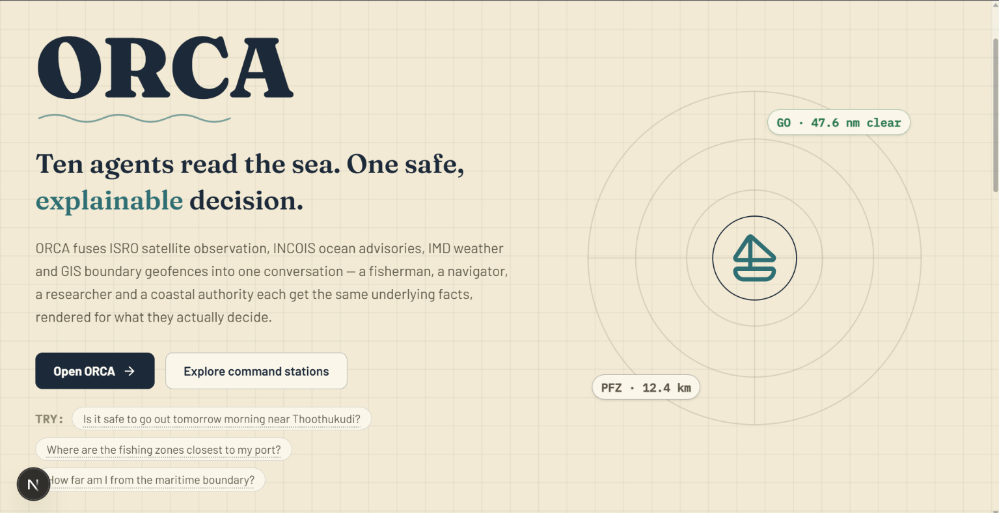
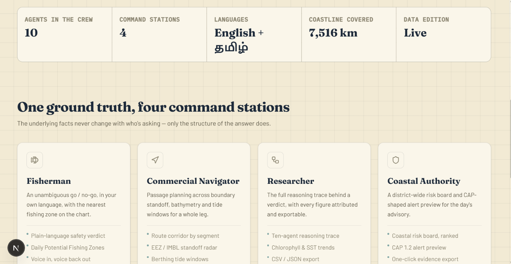
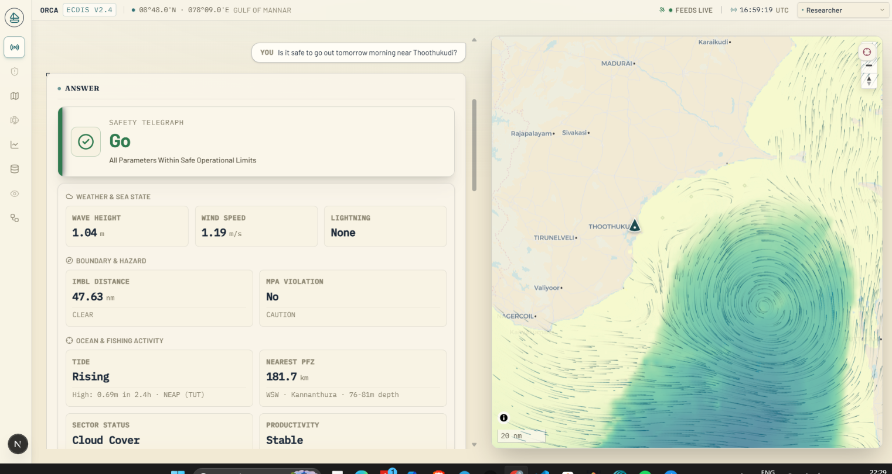
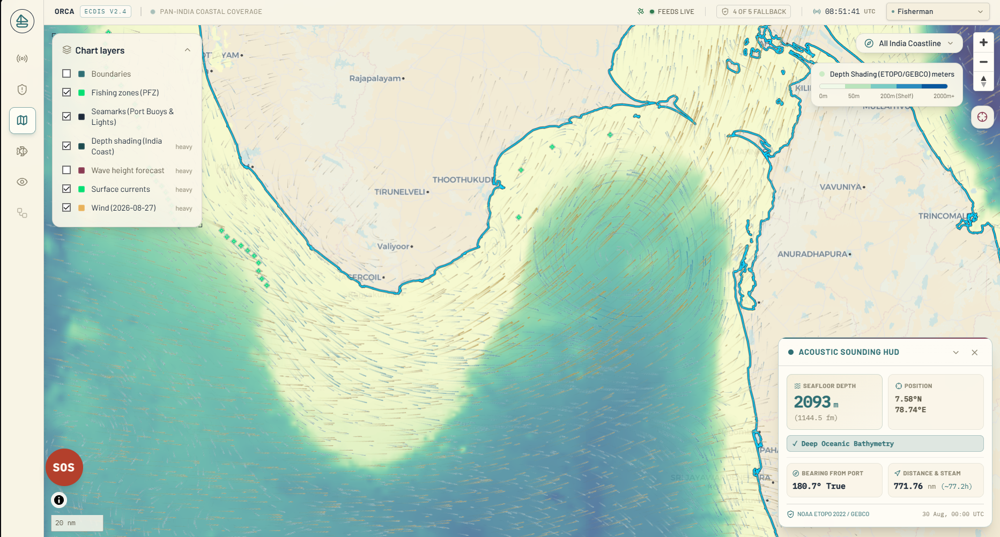
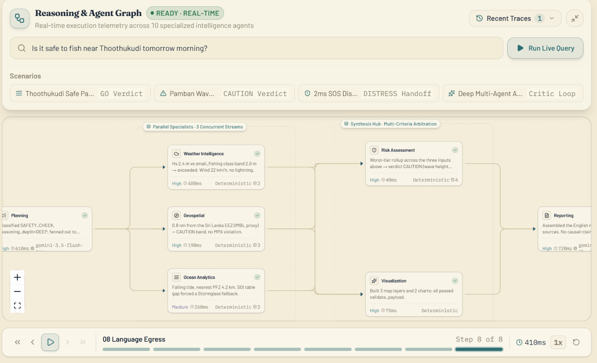

<div align="center">

# 🌊 ORCA
### Ocean Reasoning with Collaborative Agents

*Smart Coastal Intelligence Platform for India's Marine Safety Challenge*

[](https://python.org)
[](https://nextjs.org)
[](https://fastapi.tiangolo.com)
[](https://github.com/langchain-ai/langgraph)
[](https://postgis.net)
[](https://docker.com)

**SIH26176 · ISRO · Theme: Disaster Management**

*"Is it safe to go to sea tomorrow?"* — answered in Tamil, in seconds, with a map.

</div>

---

<table>
  <tr>
    <td align="center" width="50%">
      
      <br/><sub><b>🗺️ ORCA Interface Overview</b></sub>
    </td>
    <td align="center" width="50%">
      
      <br/><sub><b>🏛️ Four Command Stations</b></sub>
    </td>
  </tr>
</table>

---

## What is ORCA?

ORCA is a **conversational, multi-agent decision-support system** that sits on top of India's fragmented marine data ecosystem — INCOIS, MOSDAC, IMD, Bhuvan, Copernicus, NASA — and turns a fisherman's question into a synthesized, evidence-backed, multi-source answer, in their own language, with a map and a clear verdict.

**Coverage, stated exactly.** ORCA does **national place resolution and national PFZ sectors**, with **deep validation in the Gulf of Mannar pilot**. A question naming Veraval, Kakinada, Paradip, Digha, Port Blair or Kavaratti resolves to that place, on that coast, in its own INCOIS sector — it is not answered with Tamil Nadu's numbers. What the pilot region adds is depth, not reach: surveyed positions, a hand-checked MPA polygon, a tide-gauge station and published catch validation, none of which exist yet for every coast. Where a position or a sector is a fallback rather than the one you asked about, ORCA says so on the card before it answers.

The pilot region itself is the **South Tamil Nadu coast** — Thoothukudi, Rameswaram, Kanyakumari, Palk Bay, and the Gulf of Mannar:

> 🚨 Fishermen in this region are regularly detained for accidental IMBL crossings into Sri Lankan waters.
> The Gulf of Mannar Marine National Park creates an active MPA boundary.
> NE monsoon cyclones make hazard alerting non-hypothetical.

> **ORCA's safety decisions are never generated by an LLM.** Go/no-go verdicts, geofence breaches, and hazard tiers are computed by deterministic Python math. The LLM's only job is to explain an already-established fact in plain language.

---

## 👥 Who Is It For?

ORCA serves four distinct user personas. Every persona receives a different depth and style of response from the **same underlying computation** — the analysis never changes, only its presentation.

<table>
<tr>
<th>Persona</th>
<th>Core Question</th>
<th>What They Get</th>
</tr>
<tr>
<td><b>🐟 Fisherman</b></td>
<td>"Is it safe to go to sea?"</td>
<td>Large <b>GO / CAUTION / NO-GO</b> banner · Voice audio in Tamil or Hindi · Single map pin · No jargon</td>
</tr>
<tr>
<td><b>🚢 Commercial Navigator</b></td>
<td>"What's the safest route to the fishing ground?"</td>
<td>Waypoint table with lat/long + ETA · Bathymetry profile · Tidal berthing windows · Route polyline</td>
</tr>
<tr>
<td><b>🔬 Researcher</b></td>
<td>"Show me the chlorophyll anomaly trend, last quarter"</td>
<td>Statistical summary (mean, Δ, R²) · Full sensor metadata · Time-series chart · CSV / NetCDF export</td>
</tr>
<tr>
<td><b>🚨 Coastal Authority</b></td>
<td>"District-level risk for the next 48 hours"</td>
<td>District threat matrix · CAP-format alert payload · SMS / IVR broadcast template · Evacuation buffers</td>
</tr>
</table>

> A misclassified user taps a single **"This isn't right for me"** control to re-render the same already-computed answer under the correct persona — no re-query, no delay.

---

## ✨ Key Features

<table>
<tr>
<td width="50%">

**🤖 No AI in the Safety Core**
A LangGraph `StateGraph` orchestrates sixteen graph nodes that genuinely collaborate — five of them never call a model at all, and every node that can stop someone going to sea is one of the five.

</td>
<td width="50%">

**🛡️ Deterministic Safety Engine**
All go/no-go decisions, geofence breaches, and hazard tiers are computed by explicit Python threshold math. Zero LLM hallucination on safety — ever.

</td>
</tr>
<tr>
<td>

**🗣️ Multilingual Voice Interface**
Speak in Tamil, Hindi, Telugu, Malayalam, Kannada, Bengali, Marathi, Gujarati, Odia, or English — all 10 detected and typed replies translated. Voice playback is round-trip verified for 4 of them (Tamil, Hindi, Telugu, English); the rest fall back to an unverified local TTS checkpoint.

</td>
<td>

**📡 Real-Time Agent Trace Panel**
Every agent hand-off streams live to the user — which datasets were chosen, why, and at what confidence — not buried in a log file.

</td>
</tr>
<tr>
<td>

**🔔 Proactive Sentinel Alerts**
A background agent polls registered locations every 2 minutes. When conditions cross a threshold, it pushes an in-app alert — without the fisherman opening the app. SMS/IVR/USSD channels are modeled and the message is rendered and stored for each (shown as SIMULATED in the feed), but no real transport is wired up yet.

</td>
<td>

**🆘 SOS & Distress Handling**
Pattern-matched (not LLM-inferred) distress detection. On trigger: immediately surfaces Coast Guard MRCC contact details and emits a DAT-SG-compatible handoff payload.

</td>
</tr>
<tr>
<td>

**📋 Evidence-Cited Responses**
Every claim carries its source dataset, acquisition timestamp, and a 3-tier confidence rating (HIGH / MEDIUM / LOW-DATA). No claim is made without provenance.

</td>
<td>

**🗺️ Interactive Marine Map**
MapLibre GL renders live PFZ overlays, IMBL and MPA boundary geofences, ocean state rasters, route vectors, wind flow fields, and chlorophyll heatmaps on one canvas.

</td>
</tr>
<tr>
<td>

**🌀 Cyclone Gaja Replay Mode**
Full historical replay using authentic IMD/MOSDAC data. Demonstrates live cyclone alerting outside cyclone season.

</td>
<td>

**⚖️ Critic Agent**
Every query passes through a fact-checking Critic Agent before it reaches the user, at any reasoning depth — the one exception is a hard-constraint NO_GO (cyclone, lightning, an IMBL or MPA breach), which is a cost skip, not a quality one.

</td>
</tr>
</table>

---

## 🧠 The Agent Pipeline

Every query flows through a compiled LangGraph `StateGraph`. Each node is a named, specialized agent. Here is the exact wiring:

> **Why the labels below run to Agent 12 while the graph itself has fifteen nodes:** the numbers are stable role IDs, not a headcount. Agent 3 (Discovery) is its own node (`marine_data_discovery`) but shares Agent 5's diagram slot below since both feed Ocean Analytics' source selection, and Agent 1 (Language) appears twice in the diagram — ingress and egress — because it's the same agent used at both ends of the pipeline. The compiled graph (`orca/graph/graph.py`) has fifteen nodes: `distress_check`, `out_of_scope`, `language_ingress`, `planning`, `marine_data_discovery`, `weather_intelligence`, `geospatial`, `ocean_analytics`, `risk_assessment`, `visualization`, `reporting`, `critic`, `critic_cancelled`, `critic_reinvoke`, `language_egress`. **Five never call a model at all** — `distress_check`, `weather_intelligence`, `geospatial`, `risk_assessment`, `visualization` — and every node that can stop someone going to sea is one of the five. `ocean_analytics` calls an LLM only at `DEEP` reasoning depth; `language_ingress`/`language_egress` run IndicTrans2, a local neural translation model, not a hosted LLM; `critic` runs on every query now, not only at `DEEP` — the one exception is a hard-constraint NO_GO, skipped for cost, not quality — with `critic_cancelled`/`critic_reinvoke` handling its re-invocation budget.

```
 ┌─────────────────────────────────────────────────────────────────────┐
 │                         USER QUERY                                  │
 └─────────────────────────┬───────────────────────────────────────────┘
                           │
                           ▼
              ┌────────────────────────┐
              │  Agent 12 · Distress   │  ← Pattern-match SOS keywords,
              │  Check                 │    or explicit SOS button tap
              └──────────┬─────────────┘
                         │
           ┌─────────────┴────────────────────┐
           │ SOS detected                     │ Normal query
           ▼                                  ▼
    MRCC Handoff → END        ┌───────────────────────────┐
                              │  Agent 1 · Language Ingress│
                              │  Tamil/Hindi/... → English │
                              │  Detect persona            │
                              └──────────┬────────────────┘
                                         │
                              ┌──────────▼────────────────┐
                              │  Agent 2 · Planning        │
                              │  Classify intent           │
                              │  Build execution plan      │
                              └───┬──────────┬──────────┬──┘
                                  │          │          │
                          ┌───────▼──┐ ┌─────▼────┐ ┌──▼──────────┐
                          │ Agent 4  │ │ Agent 6  │ │  Agent 5    │
                          │ Weather  │ │Geospatial│ │   Ocean     │
                          │ Intel    │ │ IMBL/MPA │ │ Analytics   │
                          │IMD/Meteo │ │  GEBCO   │ │INCOIS/tides │
                          └───────┬──┘ └─────┬────┘ └──┬──────────┘
                                  │          │          │
                                  └──────────┼──────────┘
                                             │
                          ┌──────────────────┴──────────────────┐
                          │                                      │
                   ┌──────▼──────┐                    ┌─────────▼──────┐
                   │  Agent 7    │                    │   Agent 8      │
                   │    Risk     │                    │ Visualization  │
                   │ Assessment  │                    │MapLibre layers │
                   │ (pure math) │                    │  chart specs   │
                   └──────┬──────┘                    └─────────┬──────┘
                          └──────────────┬────────────────────┘
                                         │
                              ┌──────────▼────────────────┐
                              │  Agent 9 · Reporting       │
                              │  Persona-aware synthesis   │
                              │  Evidence citations        │
                              └──────────┬────────────────┘
                                         │
                        ┌────────────────┴─────────────────┐
                        │ every query                      │ hard NO_GO (cost skip)
                        ▼                                  ▼
             ┌───────────────────┐            ┌────────────────────────┐
             │  Agent 10 · Critic│            │  Agent 1 · Language    │
             │  Fact-check causal│            │  Egress → vernacular   │
             │  claims & citations│            └──────────┬─────────────┘
             └──────────┬────────┘                        │
                        │                                  ▼
                        └────────────────────────►  USER RESPONSE
```

**Running continuously in the background:**

| Agent | Role |
|---|---|
| **Agent 11 · Sentinel** | Polls every registered watch location every 120 s. On threshold crossing (GO→CAUTION→NO-GO), dispatches an in-app notification — no user action required. SMS/IVR/USSD are rendered and stored (SIMULATED in the feed) but have no real transport wired up |

---

<table>
  <tr>
    <td align="center" width="50%">
      
      <br/><sub><b>⚡ Live Agent Trace Panel</b></sub>
    </td>
    <td align="center" width="50%">
      
      <br/><sub><b>🛡️ Safety Verdict &amp; Map Overlay</b></sub>
    </td>
  </tr>
</table>

---

## 🏗️ Architecture

### Backend — FastAPI + LangGraph

The backend (`backend/orca/api/main.py`) is a FastAPI application on Python 3.11. Its primary interface is a **streaming SSE endpoint** (`GET /query`) that flushes one `agent_span` frame per agent as it completes, followed by a single `final_response` frame containing the full answer, verdict, map layers, citations, and audit trace.

Key engineering decisions:

- **Priority lane / backpressure** — SAFETY_CHECK queries (fisherman asking if it's safe during a cyclone) run in a dedicated `asyncio.Semaphore` pool, separate from all other traffic. A demand spike can never starve the highest-stakes queries.
- **Query cache + request coalescing** — Two identical queries arriving within the same window are folded into one upstream invocation. Results are cached in-memory with source-appropriate TTLs.
- **Sentinel background loop** — Started from FastAPI's lifespan context. Acquires a Postgres session-level advisory lock so only one process ever fires watch notifications, even in multi-instance deployments.
- **Fail-safe degradation** — Every agent is wrapped in `run_traced_node`, which catches exceptions and degrades to an empty output rather than aborting the pipeline. A broken weather feed produces a LOW-DATA verdict, not a 500 error.

### Frontend — Next.js 16 + MapLibre GL

The frontend is a Next.js 16 / React 19 application that progressively renders the agent trace panel and final answer as SSE frames arrive. Map rendering uses MapLibre GL 6 with Deck.gl for advanced overlays.

### Database Layer

| Service | Purpose |
|---|---|
| **PostgreSQL 16 + PostGIS** | User accounts, vessel profiles, audit trace log, Sentinel watch subscriptions, session history |
| **Redis 7** | Query cache TTLs, request coalescing |

> Phase 1 (minimal local setup) runs entirely in-memory with GeoPandas. Postgres and Redis are only needed for Phase 2+ features (auth, persistent traces, Sentinel watches).

---

<div align="center">
  
  <br/><sub><b>🌊 ORCA — Full System View</b></sub>
</div>

---

## 🖥️ Frontend Pages

| Route | What it does |
|---|---|
| **`/`** | Home — main conversational interface with voice input, live streaming agent trace, answer card |
| **`/ask`** | Dedicated voice/text query page |
| **`/map`** | Full-screen MapLibre GL map — PFZ overlays, IMBL boundary, MPA geofence, weather layers |
| **`/safety`** | Safety dashboard — wave height gauge, wind speed, lightning status, IMBL distance |
| **`/trends`** | SST and chlorophyll time-series charts for the pilot region |
| **`/zones`** | Sector zone browser with PFZ persistence scores |
| **`/voyage`** | Voyage plan builder — bathymetry-aware route optimization with geofence constraints |
| **`/watches`** | Sentinel watch subscription management |
| **`/ops`** | District-level operational dashboard for coastal authorities |
| **`/reasoning`** | Full agent reasoning trace viewer for any past query ID |
| **`/persona`** | Side-by-side comparison of all four persona renderings of the same query |
| **`/design`** | Component design system reference |
| **`/login`** | Authentication |

---

## 🌐 Backend API Reference

### Primary endpoint — `GET /query`

Runs the full LangGraph pipeline. Responds as a streaming `text/event-stream`.

**Query parameters:**

| Parameter | Type | Description |
|---|---|---|
| `q` | `string` | User's query in any supported language |
| `lat` / `lon` | `float` | GPS coordinates (resolved from query text if absent) |
| `persona` | `string` | `fisherman` · `commercial_navigator` · `researcher` · `coastal_authority` |
| `depth` | `string` | `SHALLOW` · `STANDARD` · `DEEP` (default: `SHALLOW`) |
| `vessel_class` | `string` | `small_fishing` · `mechanized_trawler` · `cargo_vessel` |
| `distress` | `bool` | `true` to activate the SOS / distress path directly |

**SSE event types:**

```jsonc
// agent_span — one per agent as it finishes
{
  "type": "agent_span",
  "agent_name": "weather_intelligence",
  "status": "ok",
  "confidence_tier": "HIGH",
  "latency_ms": 312,
  "reasoning_summary": "Wave height 1.4 m — within safe limits",
  "used_llm": false
}

// final_response — one at the end
{
  "type": "final_response",
  "final_english_response": "...",
  "final_vernacular_response": "...",    // in user's language
  "risk_assessment": { "go_no_go": "GO", "status": "SAFE" },
  "confidence_tier": "HIGH",
  "citations": [...],
  "visualization_payload": { "map_layers": [...], "chart_specs": [...] },
  "ocean_summary": { "tide": {...}, "nearest_pfz": {...} },
  "weather_summary": { "wave_height_m": 1.4, "wind_speed_ms": 6.1 },
  "hazard_breakdown": { "imbl_distance_nm": 12.3, "mpa_violation": false }
}
```

**Other API endpoints:**

| Endpoint | Description |
|---|---|
| `GET /health` | Liveness check |
| `GET /api/analytics/zones` | Sector zone status + PFZ data |
| `GET /api/analytics/trends` | SST / chlorophyll trend time-series |
| `GET /api/analytics/tides` | Tide predictions |
| `GET /api/geospatial/boundary` | IMBL / MPA proximity check |
| `GET /api/geospatial/depth` | Bathymetry depth lookup |
| `GET /api/voyage-plan` | Compute a bathymetry-aware voyage plan |
| `POST /api/voice/transcribe` | Speech-to-text (Bhashini ASR seam, prepared not connected — pending government portal access — falls to local faster-whisper) |
| `POST /api/voice/speak` | Text-to-speech (Bhashini TTS seam, prepared not connected — falls to local `facebook/mms-tts`) |
| `GET /api/trace/{query_id}` | Retrieve full stored trace for a past query |
| `GET /api/watches` | List Sentinel watch subscriptions |
| `POST /api/watches` | Create a new watch |
| `GET /api/notifications` | List notifications |
| `POST /api/feedback` | Submit feedback on a response |
| `GET /api/replay/gaja` | Cyclone Gaja historical replay |
| `POST /auth/register` | Register a new user |
| `POST /auth/login` | Login and receive JWT |

---

## 🛰️ Data Sources

ORCA integrates the following authoritative Indian and global marine data sources. **No API key is needed** for the sources marked 🔓.

| 🔓 / 🔑 | Source | Data Provided |
|---|---|---|
| 🔓 | **INCOIS ERDDAP** | Oceanographic datasets via OPeNDAP/REST — buoy, model, satellite |
| 🔓 | **INCOIS PFZ Advisory** | Potential Fishing Zones, updated ~3×/week from SST + chlorophyll |
| 🔓 | **INCOIS Ocean State Forecast** | Wave height, currents, sea-state forecasts |
| 🔓 | **INCOIS Hazard Advisories** | Tsunami early warning, storm surge, high wave alerts |
| 🔓 | **MOSDAC** | Near-real-time SST, ocean color, INSAT-3D weather, cyclone tracks |
| 🔑 | **IMD API** (`api.imd.gov.in`) | Localized marine forecasts — the preferred source for Palk Bay accuracy |
| 🔓 | **IMD CAP / SACHET** | Cyclone tracks, CAP 1.2 alert bulletins |
| 🔓 | **IMD Damini** | Lightning nowcast |
| 🔓 | **Open-Meteo Marine** | Hourly wave height, swell, wind, ocean currents (global, offshore baseline) |
| 🔓 | **Survey of India Tide Tables** | Official tidal height predictions |
| 🔑 | **Copernicus Marine (CMEMS)** | SST / reanalysis, historical depth |
| 🔑 | **NASA Ocean Color / OB.DAAC** | Chlorophyll-a concentration rasters (MODIS) |
| 🔓 | **GEBCO** | 15 arc-second global bathymetry grid |
| 🔓 | **Marine Regions (VLIZ)** | Authoritative EEZ and IMBL boundary geometries |
| 🔓 | **WDPA / Protected Planet** | Marine Protected Area polygons (Gulf of Mannar MNP) |
| 🔓 | **data.gov.in** | Fisheries catch statistics by state and district |
| 🔑 | **Global Fishing Watch** | Vessel activity context layers (optional) |

---

## 📦 Tech Stack

<div align="center">

| Layer | Technology |
|---|---|
| **Agent Orchestration** | LangGraph (StateGraph) |
| **Backend API** | FastAPI 0.115+, Python 3.11, Uvicorn |
| **LLM Providers** | Anthropic Claude · OpenAI GPT · Google Gemini · DeepSeek · Ollama |
| **Language / Translation** | IndicTrans2 (local, primary) · Bhashini ULCA NMT API (seam prepared, not yet connected) |
| **Speech-to-Text** | faster-whisper `small` (local, primary) · Bhashini ASR (seam prepared, not yet connected) |
| **Text-to-Speech** | `facebook/mms-tts` (local, primary) · Bhashini TTS (seam prepared, not yet connected) |
| **Geospatial** | GeoPandas · Shapely · PyProj |
| **Data Processing** | xarray · NumPy · Pandas · SciPy · h5py |
| **Database** | PostgreSQL 16 + PostGIS · SQLAlchemy |
| **Cache** | Redis 7 · In-memory LRU |
| **Frontend** | Next.js 16 · React 19 · TypeScript · Tailwind CSS |
| **Map Rendering** | MapLibre GL 6 · Deck.gl 9 · maplibre-gl-wind |
| **Charts** | Recharts 3 |
| **UI Motion** | Framer Motion · React Flow (@xyflow/react) · Lucide Icons |
| **Auth** | JWT · FastAPI Depends DI |
| **Testing** | pytest · Playwright · axe (accessibility) |
| **Containers** | Docker · Docker Compose |

</div>

---

## 🧭 Design Principles

These ten principles are non-negotiable. Every agent, every API response, and every optimization is checked against them.

| # | Principle |
|---|---|
| **1** | **Sixteen graph nodes, mapped to ISRO's named roles — five never call a model.** The architecture builds exactly what the problem statement asked for, and the nodes that gate whether a boat leaves port are deterministic Python, not text generation. |
| **2** | **Intent decides what fires. Persona decides how it's said.** The planning agent is completely persona-blind. Only the reporting agent reads persona. A misclassified fisherman never gets silently truncated analysis. |
| **3** | **Zero LLM hallucination on safety.** Go/no-go decisions, geofence breaches, and hazard tiers are deterministic Python math — never generated text. |
| **4** | **Every claim is provenance-stamped.** Source dataset, acquisition timestamp, and confidence tier travel with every fact to the user. |
| **5** | **Persona is resolved explicitly wherever possible; inference is a fallback, never a gate.** The system cannot silently lock anyone into a worse experience. |
| **6** | **Uncertainty defaults to the safety-conservative rendering.** Low-confidence data, unresolved persona, or ambiguous intent — all show the cautious version, not a confident guess. |
| **7** | **Quality validation runs regardless of persona.** Every query passes through the Critic Agent, at any reasoning depth — a fisherman's diagnostic query deserves the same fact-checking a researcher's does. |
| **8** | **Safety-critical monitoring does not wait for a query.** The Sentinel Agent runs continuously. A fisherman who never opens the app before a cyclone still gets an alert. |
| **9** | **Every emergency signal has exactly one owner, and it is never the LLM.** Distress detection and Coast Guard handoff is deterministic pattern-matching, not semantic inference. |
| **10** | **Optimizations must never trade against principles 3, 6, or 8.** Every performance shortcut in the codebase has been explicitly checked against this constraint. |

---

## 🗺️ Pilot Region — South Tamil Nadu

**Pilot is not the same as coverage.** Place resolution and PFZ sectors are national (see "What is ORCA?" above): every coastal state and both island territories resolve to their own positions and their own INCOIS sector. This section is about where ORCA has been *validated deeply*, which is a smaller claim and a different one.

ORCA's pilot region is the **South Tamil Nadu coast** — Thoothukudi, Rameswaram, Kanyakumari, Palk Bay, and the Gulf of Mannar. This is the only region in India where all five stakeholder groups named in the problem statement have a **current, non-hypothetical** reason to use the platform simultaneously:

- 🐟 **Fishermen** — Real, documented IMBL crossing consequences in the Palk Strait, as recently as 2026.
- 🔬 **Researchers** — Published academic validation: 44.9% of PFZ hits cluster on the Thoothukudi mid-shelf, driven by Thamirabarani river discharge — citable ground truth for the Ocean Analytics agent.
- 🚨 **Coastal Authorities** — NE monsoon cyclone exposure makes hazard alerting non-simulated.
- 🚢 **Maritime Operators** — Route optimization has genuine multi-layer constraints: the IMBL, the Gulf of Mannar MPA, and GEBCO depth contours.
- 🏛️ **ISRO / INCOIS Judges** — Two active INCOIS sectors (North TN, South TN) allow sector-boundary handling to be demonstrated with real data.

**Cyclone seasonality mitigation:** For demonstrations outside October–December, the platform includes **Cyclone Gaja replay mode** — a full historical simulation using authentic IMD/MOSDAC data from its direct landfall on the South Tamil Nadu coast.

> The IMBL boundary-crossing feature is presented strictly as a **fisherman-safety navigation aid** — "alert me before I approach the line" — never as commentary on the India–Sri Lanka political dispute.


<div align="center">


*Making India's seas safer, one answer at a time.*

Made with ❤️ by **GeekMaxxers** 

</div>
