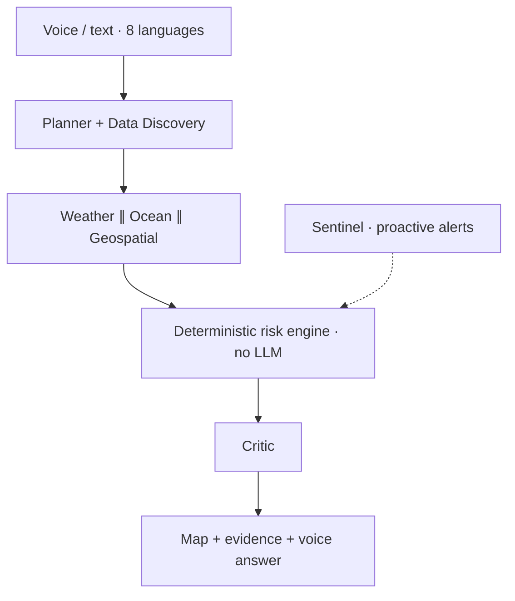
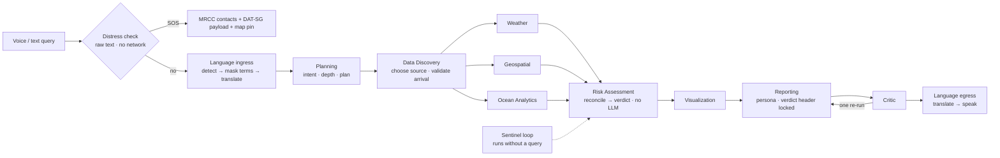

# ORCA — SIH26176 PPT: Judge's Review + Slide-by-Slide Rewrite

> **How to use this file.** Part A is the brutal review (scores, what a judge will attack). **Part B0 is what goes on the slides.** Part B is the detailed backup / speaker-notes text. Part C is the "make it true by 30 September" list. Paste B0 slide by slide into Notion (Notion keeps headings, tables, bullets and Mermaid code blocks when you paste Markdown).
>
> **Why this is a file and not edited in Notion.** The Notion connector never loaded in this chat, and the page itself needs JavaScript, so I could not read or write it. The slide text I scored is the `ppt.md` you uploaded.
>
> **Reading of your "boring" instruction.** I read it as *"must NOT be boring — every point must deliver"*. Every bullet below carries a fact, a number, a named system or a proof. Filler was deleted.
>
> **Slide 4 is missing from `ppt.md`.** Your slides run 2, 3, 5, 6, 7, 8. I assumed Slide 4 = **Workflow + Tech Stack/Architecture** (your items 3 and 4 share one SIH slide). If those exist only as diagrams in Notion, ignore my "absent" verdict and use my text as a checklist against them.
>
> **Date basis:** 23 Sep 2026. Your own plan (P0.7) says submission is **30 Sep** — 7 days.

> **REVISION 2 — after a second reviewer's feedback.** What changed in this file:
> 1. New **Part B0 = what actually goes *on* each slide** (one message per slide, short). Part B is now the **backup / speaker-notes** text.
> 2. **Slide 1** spec added (theme, Team ID, name expansion).
> 3. New **A7** (my take on the second review) and **A8 — threshold provenance**, including a finding that ORCA's wind NO-GO is **looser than IMD's own fishermen-warning practice**.
> 4. Safer wording everywhere: "₹0" → "₹0 LLM-inference cost"; "zero connectivity" → "last verified state, with its age"; "IMBL" → "provisional maritime-boundary awareness layer"; "the gap nobody fills" → "the gap ORCA addresses".
> 5. Core demonstrator framed as **three pillars**; the ten agents given as **one exact list**.
> 6. **C6** gives a measurement recipe for every result, so the placeholders can be replaced with real numbers.

---

# PART A — THE JUDGE'S VERDICT

## A1. Scorecard (as it stands in `ppt.md`)

| Slide | Content | Score /10 | One-line verdict |
|---|---|---|---|
| 2 | Problem | **5.0** | Great instinct ("manual orchestration"), but the hook stat is unsourced, the headline causal claim is contradicted by Parliament's own committee, and half the "why existing systems fail" list is refuted by your own competitor table. |
| 3 | Solution + Innovation | **6.0** | Strong safety-engineering story. Reads as a *safety checker*, not *Agentic AI*, and hides 5 of the PS's 8 benchmark questions. Several claims are not built yet. |
| 4 | Workflow + Tech Stack / Architecture | **n/a (absent)** | Not in `ppt.md`. Judges score a missing architecture slide as a zero. Drafted in Part B. |
| 5 | Impact & Benefits | **4.0** | Stakeholder list with no ORCA-measured number. The one hard figure (~30% fuel) is a *competitor's* result. |
| 6 | Feasibility & Viability | **4.5** | Feasibility table is good. **Business justification is essentially absent**, it contradicts Slide 3 on Bhashini, and it overclaims offline/CI/deploy. |
| 7 | Future Scope + Novelty | **6.0** | Best table in the deck, but it beats a strawman ("static rule-based manual dispatch") instead of named prior art, and leaves out the two systems a judge will name first (Nabhmitra/VCSS, INCOIS SVAS). |
| 8 | Research & References | **3.0** | This is a list of data sources, not research. Zero papers, zero government reports. "Keep as-is" is the wrong call. |
| | **Average of 6 scored slides** | **4.8 / 10** | With one slide missing, the deck as it stands is **not shortlist-safe**. |

**Projected after Part B + Part C are done:** ~7.5–8 / 10. That is my estimate, and it depends on the five measurable items in Part C being real numbers, not placeholders.

## A2. Scored against your senior's four criteria

| Criterion | Score | Why |
|---|---|---|
| **Relevance to PS** (solve *all* parts) | **4 / 10** | Your **product** answers all 8 PS benchmark queries (`orca_final.md` §2.1). Your **deck** answers 1 fully, 3 partly, 4 not at all (matrix below). The PS is ISRO's; satellite Earth Observation (SST, chlorophyll, MOSDAC) barely appears. You built the full answer and presented a third of it. |
| **Feasibility & Accessibility** | **6 / 10** | Multilingual + voice + accessibility is genuinely strong and exactly what the senior asked for. Points lost for internal contradictions, offline claims that outrun the build, and no compute/BOM statement. |
| **Innovation & Research** | **5.5 / 10** | The ideas (deterministic core, reconciliation, refuse-to-guess, LLM-off bit-identical) are real and defensible. But there is **no research behind them** — no paper, no state-of-the-art review, no measured result. Your senior said innovation requires background research; the References slide proves there is none on the slide. |
| **Business Justification** | **1.5 / 10** | No TAM, no pricing, no unit economics, no compute requirement, no competitor comparison with prices or reach, no buyer named on a slide. Your spec (`orca_final.md` §28.1) already contains the right answer (institutional payer, ₹0 deterministic verdict) — it never reached a slide. |

## A3. PS coverage: what the deck shows vs what the PS asks

| PS benchmark query | In the deck today? | Where ORCA actually answers it |
|---|---|---|
| Nearest Potential Fishing Zone today | ❌ **Absent** | Ocean Analytics: nearest PFZ node, bearing, distance, sail time, persistence |
| Safe to go tomorrow morning? | ✅ Full | Risk Assessment: deterministic GO/CAUTION/NO-GO |
| Tide, weather, sea conditions near me | ❌ Absent | Weather + Ocean Analytics, per-value source chips |
| Lightning / cyclone alerts | ⚠️ Partial (no inputs named) | IMD Damini, SACHET CAP, INCOIS hazards |
| High chlorophyll + favourable SST regions | ❌ **Absent** | MOSDAC OCM-3 / INSAT-3DR / CoastWatch |
| Safest route for a vessel | ⚠️ One phrase on Slide 5 | Voyage: A* over GEBCO, per-leg CLEAR/CAUTION/BLOCKED |
| Why has productivity declined? | ❌ **Absent** | Diagnostic mode, "correlated with" discipline |
| Zones to avoid / geofencing | ⚠️ Partial | Geofence engine, bands 12/6/3/1 nm |

| PS capability | In the deck? |
|---|---|
| Natural-language intent | ⚠️ one table cell |
| Auto language detect + regional reply | ✅ |
| **Multi-turn, refine, explore scenarios** | ❌ **Absent** |
| **Autonomous data discovery / tool selection** | ⚠️ "28-source registry" (inventory, not autonomy) |
| Spatial-temporal correlation | ✅ (reconciliation) |
| Explainable + maps/charts | ⚠️ maps/charts never mentioned |
| **Proactive alerts (Sentinel)** | ❌ **Absent** — your biggest differentiator has no bullet |
| Geofence notifications | ⚠️ |
| Route optimisation | ⚠️ |
| Evidence with every answer | ✅ |

**Consequence.** A judge with the PS open beside your deck ticks fewer than half the boxes. Your senior's first criterion is "solving all parts of the prompt rather than fixating on a single component." Right now the deck fixates on safety.

## A4. Claim audit — every statement a judge can catch

| # | Claim in `ppt.md` | Problem | Fix |
|---|---|---|---|
| 1 | Hook "`282+` … IMD and INCOIS issued the warning on time" | The number has no source and the sentence has no subject. Official figure quoted to Parliament: **365** (TN 203 incl. missing; Kerala 60 dead + 102 missing presumed dead). **Parliament's Standing Committee on Home Affairs found IMD's advisory "did not warn of an impending cyclone"**, Ockhi intensified rapidly, and survivors said they had no warning. Saying the warning was on time will read as blaming the wrong failure — in front of INCOIS/ISRO judges. | Use the sourced 365 and the committee's finding. It is also *better* for you (see Part B). |
| 2 | "One bulletin for an entire sea-area — never localised to this boat's … vessel class" | **INCOIS SVAS (2024) is boat-specific**: a Boat Safety Index from beam size, category, wave height, steepness, 10 days ahead. | Say SVAS covers waves-vs-boat only; ORCA fuses lightning, cyclone, IMBL, MPA, closure and vessel class into one decision. |
| 3 | "Text-only, single-language alerts — no voice" / "English/Hindi text bulletins" | Your own `orca_final.md` §1.3: SAMUDRA is in 8 coastal languages, Machli has text **and audio** in 9–10 languages, INCOIS sends multilingual SMS. | Claim the real gap: no one lets you **speak a question** and get a **reasoned, spoken, explained** answer. |
| 4 | "13-node pipeline — six nodes carry zero model dependency" | The 13-node/6 figure is the **target** graph (needs the voyage node, P5.7). Your own plan (P0.8) says *quote the count from the live trace on recording day*. Also, language nodes run neural MT (IndicTrans2) — "zero *model*" is false; "zero *LLM*" is true. | Say "no LLM". Read the count off `/reasoning` the morning you export the deck. |
| 5 | Slide 6: "Bhashini voice API access still pending → IndicTrans2 + Whisper are the primary path" **vs** Slide 3/7: "Bhashini + IndicTrans2" | Contradiction on two slides. Your plan (P3.8, 2026-09-19): **Bhashini access obtained; Bhashini is primary, local models are the offline rung.** | One story: Bhashini online, local CPU models offline. |
| 6 | "Whisper + IndicTrans2 offline" for 8-language voice | Whisper-small Indic accuracy is unverified in your own architecture doc (§9.15). Offline *speech output* is **pre-rendered clips of the fixed alert vocabulary**, not free TTS (P3.8; MMS-TTS was dropped). | State it exactly: offline = local ASR/MT + pre-rendered alert audio. |
| 7 | "Offline-first PWA … keeps the safety core, boundary geometry and SOS working with zero signal" | **The safety core is server-side Python.** A phone with no signal cannot reach it. The PWA (P7.1) is your **last** phase — the plan says don't start it until Phases 0–6 finish. "Ultra-compressed telemetry sync" and "client-side indexing" appear **nowhere** in your plan or spec. | See A5 — this is the single biggest technical-credibility risk. |
| 8 | "Stream coalescing" (Slide 7 table) | Request coalescing in your architecture is a **server-side upstream-fetch** optimisation, not an offline feature. | Delete from that row. |
| 9 | "A CI test fails the build if any number reaches the UI without a source" | Your plan (P0.12) says explicitly: **do not claim a fabricated-number guard — it cannot be checked statically.** What exists is a narrow unit test: every numeric field in a fixture-built `final_response` has non-empty `source_provenance`. | Claim exactly that. |
| 10 | "One command brings up the full stack" | Your plan (P6.12): `docker-compose.yml` has **only Postgres and Redis today**. | Do P6.12 (3 h) or say "Compose brings up data services; app via one script". |
| 11 | "WCAG 2.2 AA-plus, enforced by axe-core in CI" | Automated checkers catch only a portion of WCAG failures. | "axe-core in CI plus manual sunlight-contrast and screen-reader checks". |
| 12 | "Cyclone Gaja data not yet fully procured → validated against IBTrACS and ERA5" | Two errors: telling judges you lack data; and "validated" has no defined test. Your spec says the replay uses **ERA5 + IMD best-track** through the production graph. | Say what you have. The real validation is P6.1's confusion matrix. |
| 13 | "Cross-source example: WW3 2.1 m vs Open-Meteo 3.4 m" | Illustrative numbers in a deck whose thesis is "we never invent a number". Your plan (P2.4): no live disagreement observed yet. | Capture a **real** disagreement screenshot (P6.3), or label "illustrative". |
| 14 | "Zero-cost data at the core … no licensing cost" | Two risks. (a) Freshness: your plan (P5.13) records MOSDAC chlorophyll newest file **March 2026**, MOSDAC SST stops **29 Aug**, Copernicus chlorophyll NRT holds **2023** data. (b) Licensing: Open-Meteo's free tier is for non-commercial use — **verify**, because an institutional deployment is arguably commercial. | Say "free public/government sources"; add a licence row; fix satellite freshness (P5.12/5.13/5.1). |
| 15 | "~30% fuel savings" under Impact | It is mKRISHI's field result in Maharashtra, not yours. | Keep it labelled as precedent; put your own KPI beside it. |
| 16 | "SST/chlorophyll correlation" (implied by "28-source registry … ISRO/MOSDAC") | Your plan (P5.1): `correlate_sst_chlorophyll()` returns `available: False` on every call today; ~212 MB of MOSDAC/INSAT data sit unread. | This is your **ISRO-relevance** feature. Build P5.1 before submission or do not claim it. |
| 17 | Tide predictions | Your plan (P0.7): tide table window **expires 2026-09-23 — today.** | Re-run `refresh_tide_tables.py` now; wire into `refresh_all.py`. |

## A5. The offline problem, stated plainly

Slide 2 says the problem is that **signal dies where risk begins**. Slides 3, 6 and 7 answer with an "offline PWA that runs the safety core with zero signal". A technically literate judge will ask one question: **"Where does your Python run when the phone has no signal?"**

Honest answer, from your own spec (§21): the deterministic engine runs on **cached inputs held by the backend**; the PWA serves **cached responses** when the network is down. That is genuinely useful, but it is not "the safety core runs on the phone".

What you can truthfully say:
1. **Before departure** (the moment that decides the trip, and usually in coverage): fresh verdict + 48-h forecast frames cached per home port and saved location.
2. **At sea, offline:** last verdict with a visible age badge; verdicts older than 2× their source window (minimum 2 h) are floored to CAUTION automatically (P0.5); precached boundary/MPA geometry; static SOS numbers (1554, VHF 16).
3. **Feature phones:** SMS/IVR payloads rendered (delivery through a DLT-registered gateway is a deployment step, not a code change).
4. **Vessels with an ISRO VCSS transponder:** ORCA output is compact enough for a narrowband text link; the Nabhmitra-compatible text form of the distress payload is planned (P1.7).

**Optional upgrade that would make the strong claim true (my suggestion, not in your plan):** a ~1-day client-side check — precached boundary line + browser GPS + `turf.js` point-to-line distance — so the 12/6/3/1 nm geofence bands fire on the phone with no server. That single feature converts the offline pillar from "cached" to "computes".

## A6. Slide-by-slide brutal notes

### Slide 2 — Problem (5.0)
- **Hook is wrong twice.** Unsourced "282+", and a causal story the parliamentary record contradicts. Fix is upside-down good: the Committee also recommended **integrating satellite SST into cyclone models** and **extending ISRO's vessel-tracking system to every deep-sea boat** — that is ISRO's own agenda and your natural opening.
- **"Why existing systems fail" fights your own Slide 7 competitor table.** Pick one story, the true one: the existing systems *retrieve and broadcast*; none *reason, converse, explain, or take initiative*.
- **Missing half the PS.** Nothing about fishing productivity, PFZ, chlorophyll — the *livelihood* half. The PS opens with livelihoods and the blue economy.
- **No scale.** No fisherfolk count, no craft count, no pilot geography. The census numbers are public (Part B).
- **Keep:** "a fisherman has to open three or four government apps … before dawn". Best sentence in the deck.

### Slide 3 — Solution + Innovation (6.0)
- **Reads as a rules engine with a chatbot.** The PS names *autonomous planning, reasoning, tool selection, collaboration among agents*. Your slide names none of them. Show the agentic loop (plan → select sources → parallel agents → Critic re-invokes an agent), with a visible example.
- **Five "solves the problem" bullets, one user-facing capability.** Deterministic engine, agents count and offline are architecture. The user feels: ask, answer, warning, route, SOS. Lead with those.
- **Sentinel is missing.** It is the only component that speaks first — PS-C7 verbatim.
- **Innovation asserted, not evidenced.** Your own spec says the verdict can be *scored* (confusion matrix vs INCOIS SVAS). No competitor can print that number. It is your strongest innovation claim and it is not on the slide.
- **Uniqueness bullets are good** ("we reason, they relay"; "we refuse to guess") but name the wrong comparators. Add Nabhmitra/VCSS and SVAS, the two a judge will raise.

### Slide 5 — Impact (4.0)
- **Zero ORCA-measured numbers.** Every bullet is an adjective ("cuts", "speeds", "safer").
- **Borrowed precedent presented as proof.** ~30% is mKRISHI's. Use the *sourced, national* numbers instead: NCAER (2015) — PFZ cuts search time 30–70%; ~₹3,034 crore additional annual fisher income from ocean-state + PFZ services; 27% of fishers surveyed reported avoiding loss of life through timely decisions.
- **"Governance & Trust" is a feature, not an impact.**
- **Roadmap paragraph is leftovers.** Move to Slide 7.
- **No beneficiary funnel** (national → Tamil Nadu → pilot) and no pilot KPIs.

### Slide 6 — Feasibility & Viability (4.5)
- **The most dangerous slide.** Contradicts Slide 3 (Bhashini), overclaims offline/CI/deploy, and volunteers "Gaja data not procured".
- **"Viability" is a feature list.** Judges' fourth criterion asks for TAM, pricing, compute, BOM, scalability, competitors. None present.
- **Good:** the Challenge → Mitigation format. Keep it, add a *status* column so nothing is overclaimed.

### Slide 7 — Future Scope + Novelty (6.0)
- **Strawman comparison.** "Static, rule-based, manual dispatch" is not a competitor. Compare against SAMUDRA 2.0 / SVAS, Machli, mKRISHI, Nabhmitra/VCSS, and a generic LLM chatbot.
- **Omits VCSS/Nabhmitra.** ISRO's own transponder app already does SOS, geofence, weather and PFZ over satellite. A space-agency panel will name it in the first minute. Your best framing: **ORCA is the reasoning layer upstream of it, not a rival.**
- **Future scope is an apology list.** Rewrite as staged growth with owner/dependency/exit-test.

### Slide 8 — Research & References (3.0)
- Eight data-source names. That is a data inventory. Your senior: innovation needs Google Scholar/arXiv background. Judges open this slide to check that you know the state of the art. Part B gives a verified reference set in five groups.

---

## A7. Second opinion — my take on the other reviewer's feedback

The other review scored the **PDF (7.9/10)**, which I have not seen. Where it comments on the PDF itself (Slide 1 theme, Team ID, page count), I cannot confirm it — check it yourselves.

| Their point | My view | What I changed |
|---|---|---|
| Headline "no system…" and "gap nobody fills" are too absolute (SVAS is boat-specific) | **Right.** I had already flagged SVAS but kept an absolute headline. | Slide 2 title and gap heading rewritten. |
| "Who decided 3.5 m / 55 km/h?" is the most dangerous question | **Right — and worse than they think.** See A8: ORCA's wind NO-GO is looser than IMD's own bulletins. | New A8; provenance block on Slide 3. |
| "₹0 per verdict" is indefensible | **Right.** | "₹0 LLM-inference cost" everywhere. |
| "Zero connectivity" wording | **Right** — and it matches my A5. | Reworded to the last verified state, its age, degraded confidence, refresh on reconnect. |
| Call the boundary layer "provisional", not legal | **Right.** | Renamed on Slides 3 and 6. |
| Say the core demonstrator is three things (over-scope) | **Good tactic.** | Three-pillar block on Slide 3. |
| Give one exact list of ten agents | **Right.** | List added in B0, Slide 4. |
| Slides read like a spec, not a pitch | **Right** — I said so in my own 7.0 rating. | Part B0 (on-slide versions). |
| Too many `⟦MEASURE⟧` placeholders | **Right.** But see the warning below. | C6 measurement recipes; B0 carries only 5 result slots. |
| Slide 1 shows the wrong theme / a placeholder Team ID | **Can't verify.** Your own spec says "Disaster Management"; they say the portal says "Space Technology". **The SIH portal page for SIH26176 is the authority.** | Slide 1 spec in B0. Also: your spec expands ORCA as *Ocean & Marine EcOsystem Reasoning with Collaborative Agents*; they quote *Ocean Reasoning & Coastal Awareness*. **Pick one** and use it everywhere. |
| Novelty / future scope missing from the PDF | **Right if true** — it is your strongest slide. If the template caps pages, fold it into Slide 3 (3 innovations) and the last slide (roadmap). | Slide 7 kept; merge option noted. |

**Where I disagree**
- **Their 7.9 and the 9.0-range sub-scores rate documentation, not evidence.** They say so themselves ("how much is actually working"). "PS alignment 9.2" is too high while the SST × chlorophyll correlation — the satellite-EO core of an ISRO problem statement — returns `available: False` in your own plan (P5.1).
- **They did not fact-check.** Nothing on the Ockhi claim, the Bhashini contradiction, the competitor cells, or the tide table that expires today.
- **References.** They suggest 3–5 on the slide. Your senior said research matters, so keep a curated **8** on the slide and the rest in an appendix or QR — unless the template forces fewer.

**⚠ Do not copy their example numbers.** "62 test queries, p95 = 4.1 s, 1.8 LLM calls, 58/62 routed" are *illustrations*. Pasting invented figures into a deck whose thesis is "we never fabricate a number" is the fastest way to lose it. Measure yours (C6).

**They also say the deck claims "already runs / verified live / built / 118 implementation points".** "118 points" is your internal plan's language — cut it. Every "built" or "tested" claim must be something you can show live in 30 seconds; anything you cannot show, reword as "designed" or "planned".

## A8. Threshold provenance — the question a judge will hammer

**What I found.** IMD's own fishermen warnings (bulletins I checked from 2021–2025) tell fishermen **not to venture out** when forecast wind is roughly **35–50 km/h gusting to 55–60 km/h with "rough" to "very rough" seas**:

| Bulletin | Wind / sea in the warning | Advice |
|---|---|---|
| IMD RMC Kolkata, 9 Jul 2025 | 35–45 km/h gusting 55; rough to very rough | Not to venture |
| IMD RMC Kolkata, 26 Jul 2025 (Andaman) | 35–45 gusting 55; rough | Not to venture; INCOIS High Wave Alert 3.1–3.3 m |
| IMD RMC Kolkata, 29 Jun 2024 | 40–50; rough to very rough | Not to venture |
| IMD Thiruvananthapuram, 29 Jul 2021 | 40–50 | Not to venture; INCOIS High Wave Alert 2.5–3.6 m |
| IMD Chennai, 20 Apr 2024 | 40–45 gusting 55 | Not to venture |
| INCOIS *High Wave Watch*, 29 Jun 2024 | waves 1.9–2.3 m | "No immediate action required" |

(URLs: `rsmcnewdelhi.imd.gov.in/uploads/archive/45/` — files `45_e394d2`, `45_e2a404`, `45_06a46a`, `45_523481`, `45_d3da1b`.)

**Your engine's small-vessel bands:** wind CAUTION 35–55 km/h, **NO-GO ≥ 55 km/h**; waves CAUTION 2.0–3.5 m, NO-GO ≥ 3.5 m.

**The problem:** at a sustained 40–50 km/h, IMD says "do not go" and ORCA says **CAUTION**. That is the opposite of the "we lean conservative on purpose" story on your slides, and a judge who has read an IMD bulletin can say so in one sentence. The wave bands look defensible (they line up with INCOIS Watch ≈ 2 m and Alert ≥ 2.5 m in the bulletins above), but I only saw examples, not INCOIS's formal category definitions — verify.

**Caveats:** I have not seen your code. Check whether IMD fishermen warnings are already ingested (e.g. into `active_warnings`) and whether they already floor the verdict. Bulletins are sea-area forecasts; ORCA uses point forecasts, so a strict one-to-one match is not expected.

**Recommended fix — three deterministic steps, no LLM:**
1. **Relay, don't regrade.** An active IMD / INCOIS "not to venture" warning covering the position sets the verdict to at least the level the bulletin states, with the bulletin quoted and its ID/time cited — the same doctrine you already apply to tsunami state and CAP severity. Rule on the slide: *ORCA is never less cautious than an active official warning.*
2. **Classify every constant** in a provenance table (below) and put the table in the appendix.
3. **Let your own data choose the small-vessel wind band.** In P6.1's held-out window, score ORCA against **two** labels — INCOIS SVAS *and* IMD "not to venture" — and set the threshold that minimises false GO against both. That turns "who decided 55?" into "the held-out data, against IMD and INCOIS labels".

**Three classes of threshold (say this on the appendix slide):**

| Class | Meaning | Examples |
|---|---|---|
| **OFFICIAL — relayed** | Issued by IMD / INCOIS / NDMA; ORCA never re-grades it | Cyclone alert level, CAP severity, tsunami state, "not to venture" bulletins |
| **VESSEL-SPECIFIC** | Derived from an official boat-specific product | INCOIS SVAS Boat Safety Index (beam-based) |
| **PROTOTYPE ENGINEERING** | ORCA's own constants, calibrated and validated by you | Wave / wind bands, boundary 3 nm / 1 nm margins, trawler +0.5 m and cargo +1.5 m deltas |

**Fill this table before submission** (one row per constant in `risk_assessment.py`):

| Constant | Value | Class | Source document (title, date, page) | Validated in P6.1? |
|---|---|---|---|---|
| Wave CAUTION / NO-GO | 2.0 / 3.5 m | Prototype | `⟦FILL⟧` | `⟦FILL⟧` |
| Wind CAUTION / NO-GO | 35 / 55 km/h | Prototype ⚠ looser than IMD practice | `⟦FILL⟧` | `⟦FILL⟧` |
| Boundary CAUTION / NO-GO | 3 / 1 nm | Prototype safety margin over EEZ-proxy error | `⟦FILL⟧` | `⟦FILL⟧` |
| Vessel deltas | +0.5 m trawler · +1.5 m cargo | Prototype | `⟦FILL⟧` | `⟦FILL⟧` |
| Cyclone Red / Orange = NO-GO | — | Official — relayed | IMD / SACHET | n/a |
| Lightning active = NO-GO | — | Policy choice on official Damini nowcast | `⟦FILL⟧` | `⟦FILL⟧` |

---

# PART B0 — WHAT ACTUALLY GOES ON EACH SLIDE

> **Rule:** one message per slide, about 90 words plus one visual. A judge with 5–10 minutes reads a hook, a picture and three proofs — not a specification. Everything longer lives in Part B (speaker notes / appendix).
>
> **Result slots.** Only five numbers are needed on slides. Each has a recipe in **C6** — measure them, then fill:
> **[R1]** unrehearsed queries routed correctly · **[R2]** end-to-end p95 latency · **[R3]** LLM calls per query, and LLM calls on the safety path (0) · **[R4]** LLM-off parity (verdicts identical, N of N) · **[R5]** agreement with INCOIS SVAS / IMD warnings (precision & recall, false-GO reported separately).

### Slide 1 — Title
```
ORCA
Ocean & Marine EcOsystem Reasoning with Collaborative Agents      ← one expansion only, matching your spec
AI-Based Multi-Agent Marine Intelligence and Advisory System

PS ID: SIH26176 | Team ID: <from the SIH portal> | Team: GeekMaxxers | Organisation: ISRO / Department of Space
Theme: <copy exactly from the portal's PS page>
```
Nothing else on the slide. No placeholder text may survive to export.

### Slide 2 — Problem
**India has the ocean data and the advisories. ORCA adds the reasoning layer that turns them into one explainable go / no-go for one boat.**

**365** lives — Cyclone Ockhi, 2017. Parliament's committee: IMD's advisory *"did not warn of an impending cyclone"*; survivors reported no warning.

**Who:** ~4 M fisherfolk · 8.65 lakh families · Tamil Nadu 91% of families below the poverty line.

| Today | Where it stops |
|---|---|
| SAMUDRA 2.0 / SVAS | waves-vs-boat; menu-driven |
| Machli / mKRISHI | one-way broadcast |
| IMD · SACHET | sea-area level; separate apps |
| Nabhmitra / VCSS | hardware-bound; no reasoning |

**The gap ORCA addresses:** **Fusion · Conversation · Evidence · Initiative**
*A false GO risks a life. A false NO-GO costs a day's income.*

### Slide 3 — Solution + Innovation
**ORCA — the reasoning layer between India's ocean data and the person about to sail.**

**Core demonstrator = 3 things:** ① Conversational marine intelligence (8 languages, voice) ② Deterministic multi-source safety reasoning ③ Proactive multilingual alerts + SOS

**Centre visual (screenshot):** the same query with **LLM ON** and **LLM OFF** side by side → **same GO / CAUTION / NO-GO header**, only the prose differs.

**Three innovations:** **Deterministic core, generative shell** · **Reconcile conflicting sources, refuse to guess** · **A verdict that can be scored**

**All 8 PS questions answered:** nearest PFZ · safe tomorrow? · tide/weather/sea state · lightning/cyclone · chlorophyll + SST · safest route · productivity decline · zones to avoid

**Proof strip:** LLM calls on the safety path **0** (CI-enforced) · **[R1]** queries routed · **[R4]** LLM-off parity · **[R5]** vs INCOIS/IMD
*Official warnings are relayed verbatim; ORCA's own thresholds are labelled prototype and sourced (appendix).*

### Slide 4 — Workflow + Architecture

**The ten agents:** ① User Interaction & Language ② Planning & Data Discovery ③ Weather Intelligence ④ Ocean Analytics ⑤ Geospatial Reasoning ⑥ Risk Assessment ⑦ Visualization ⑧ Reporting ⑨ Critic ⑩ Sentinel & Emergency Response
*(Graph nodes are an implementation detail — quote the number from the live trace only if asked.)*

**Stack, one line:** LangGraph · FastAPI · Bhashini + IndicTrans2/Whisper (offline) · PostGIS + Redis · MapLibre · CI guards
**Footprint:** one laptop · no GPU needed · offline language models ~1.5 GB RAM · **[R2]** p95 · **[R3]** LLM calls/query

### Slide 5 — Impact
**Funnel:** ~4 M fisherfolk → Tamil Nadu 7.96 lakh → pilot districts

| Who | KPI we will measure |
|---|---|
| Fisherfolk | question-to-verdict time · alert acknowledgement · trips avoided |
| Navigators | blocked legs caught · detour added |
| Researchers | 100% of numbers carry source + timestamp |
| Authorities | SOS-to-contact time · hazard-to-CAP time |

**Benchmarks (not ORCA's results):** PFZ use cut search time 30–70% · 27% of fishers surveyed said timely advisories helped avoid loss of life (NCAER via INCOIS) · mKRISHI ~30% fuel saving
**We do not claim:** more fish · lives saved (until pilot data) · tsunami re-derivation

### Slide 6 — Feasibility + Viability
| Risk | Mitigation |
|---|---|
| Bhashini slow / down | 3 s timeout → local CPU rung, named on the span; pre-rendered alert audio |
| Source down / stale | cascades → cached value with age → **MISSING**, never a guess; stale → CAUTION |
| No signal | last verified state + age + degraded confidence; refresh on reconnect |
| Boundary uncertainty | provisional layer, MEDIUM cap, 3 / 1 nm margins |
| LLM cost / outage | tiered; LLM-off switch; verdict unchanged |

**Business:** buyer = state fisheries depts, INCOIS, disaster authorities (same 60:40 Centre–State rail as VCSS) · fisherman free · **LLM-inference cost of a safety verdict ₹0**; cost per narrated answer **₹`⟦R3 × provider price⟧`** · anchor: VCSS ≈ ₹36,400 per vessel all-in · prototype uses open-access feeds; production licences verified per source

| | SAMUDRA/SVAS | Nabhmitra/VCSS | **ORCA** |
|---|---|---|---|
| Ask in your language | ✗ | 2-way messaging | ✓ voice + text |
| Fused go/no-go | waves only | ✗ | ✓ |
| Evidence trail | ✗ | ✗ | ✓ |
| Extra hardware | ✗ | transponder | ✗ |

*(Verify every cell against the systems' own documentation.)*

### Slide 7 — Novelty + Future Scope
| | Today | **ORCA** |
|---|---|---|
| Decision | portals / SVAS wave index / free-running LLM agents | agents plan; **arithmetic decides** |
| Conflicting sources | pick one / average | **conservative wins, confidence drops, both shown** |
| Missing data | blank or a guess | **`CAUTION_MISSING_DATA`, field named** |
| Verdict quality | asserted | **scored vs INCOIS/IMD, false-GO reported** |
| Proactivity | broadcast | **Sentinel: on worsening and on clearing** |

**Roadmap:** **Pilot** (TN season, DLT SMS, on-device geofence) → **National** (all States/UTs, VCSS text feed) → **Sovereign & hardened** (on-prem Indic LLM, pen-test)
**Non-goals:** catch prediction · tsunami re-derivation · gazetted-IMBL accuracy

### Slide 8 — References (8 on the slide, full list in appendix / QR)
1. PRS — Standing Committee on Home Affairs, *Cyclone Ockhi* · 2. Hindustan Times, 9 Mar 2018 (MHA figures) · 3. CMFRI *Marine Fisheries Census 2016* · 4. NCAER (2015) *Economic Benefits of … Ocean Information and Advisory Services* · 5. Solanki et al. (2003) *Fishery forecast using OCM chlorophyll and AVHRR SST*, IJRS 24 · 6. Solanki et al. (2010) *Synergistic application … for forecasting PFZ*, IJRS 31 · 7. Gala et al. (2023) *IndicTrans2*, TMLR · 8. Ji et al. (2023) *Survey of Hallucination in NLG* ◇
*Data: ISRO MOSDAC · INCOIS · IMD/NDMA SACHET · GEBCO · Open-Meteo · ERA5 — register in appendix.*

---

# PART B — DETAILED TEXT (backup / speaker notes — the on-slide versions are in B0)

> **Tags.** `(REL)` relevance to PS · `(FEA)` feasibility & accessibility · `(INN)` innovation & research · `(BIZ)` business justification. They mark where each of your senior's four criteria is now answered. Delete the tags before you design the slide if they clutter it.
>
> **Placeholders.** `⟦MEASURE: …⟧` marks a number that must come from your own run before 30 Sep. Do **not** ship a placeholder, and do not invent the value. Part C says how to get each one.

---

## Slide 2 — THE PROBLEM

**Title:** India has the ocean data and the advisories. ORCA adds the reasoning layer that turns them into one explainable go / no-go for *one boat*.

**Hook stat:** `365`

**Hook line:** lives lost to Cyclone Ockhi, 29 Nov 2017 — the deadliest Indian cyclone since Odisha 1999 (MHA figure to Parliament, incl. missing presumed dead). Parliament's Standing Committee found IMD's advisory *"did not warn of an impending cyclone"* as the storm rapidly intensified; survivors reported no warning on the day they sailed. Three gaps at once — a forecast that lagged, warnings that missed boats already at sea, and no per-boat decision support. The Committee's own fixes: **feed satellite SST into cyclone models** and **extend ISRO's vessel tracking to every deep-sea boat.** ORCA is built on exactly those two rails. `(REL)`

**WHO IS AFFECTED** `(REL)`
- **~4 million marine fisherfolk, ~8.65 lakh families, ~1.94 lakh fishing craft** on India's 7,516 km coast; 61% of families below the poverty line (CMFRI census, 2010).
- **Tamil Nadu pilot coast:** 7.96 lakh fisherfolk, 2.02 lakh families, 575 villages, 349 landing centres, **91% of families below the poverty line** (CMFRI 2016). One lost trip is a family-level income shock; one lost boat is a catastrophe.
- **Coast Guard / MRCC, state fisheries departments, district disaster authorities** — coordinate rescue *after* a boat is missing, from disjointed feeds.
- **Researchers and maritime operators** — hand-correlate SST, chlorophyll, waves, tides and boundaries across portals.

**WHAT EXISTS TODAY — AND WHERE EACH STOPS** `(REL)` `(INN)`

| System | What it does well | Where it stops |
|---|---|---|
| **INCOIS SAMUDRA 2.0 + SVAS** | PFZ, 5–7-day ocean state, boat-specific Boat Safety Index, 8 coastal languages | Menu-driven; wave-vs-boat only; no lightning / cyclone / IMBL / MPA fusion; cannot be asked *"why?"* |
| **Machli, mKRISHI Fisheries** | PFZ / ocean-state advisories in regional languages, audio or icon UI | One-way broadcast; no cross-source reasoning; no geofence |
| **IMD · SACHET · Damini** | Cyclone and lightning CAP feeds | Sea-area level; separate apps |
| **ISRO Nabhmitra / VCSS** | Satellite transponder: position, SOS, geofence alerts, weather | Hardware-bound; 1 lakh vessels targeted (₹364 cr), tens of thousands fitted so far; reasons over nothing |

**THE GAP ORCA ADDRESSES** `(REL)`
1. **No fusion.** Wave + wind + lightning + cyclone + boundary + protected area + vessel class → one decision. Today a fisherman opens three or four government apps and correlates them himself, on a boat, before dawn.
2. **No conversation.** Cannot ask *"what if I leave at 4 pm?"* or *"why is catch down off Kakinada?"* — the PS explicitly asks for scenario exploration.
3. **No evidence trail.** Which source, how old, do sources agree? A number without provenance cannot be trusted or audited.
4. **No initiative.** Nothing watches your boat's conditions and speaks first; nothing lets you *speak* a question in your language and hear a reasoned answer back.

**THE COST OF GETTING IT WRONG IS ASYMMETRIC**
A false GO risks a life. A false NO-GO costs one day's income — for families where 91% are below the poverty line. Any solution must be tuned toward the second error, and must *prove* it.

**Source line on slide:** PRS India — Standing Committee on Home Affairs, *Cyclone Ockhi* (2018) · Hindustan Times, 9 Mar 2018 (MHA figures) · Scroll.in, 5 Dec 2017 · CMFRI Marine Fisheries Census 2010 / 2016 · Lok Sabha AU289 & PMMSY VCSS approval · INCOIS SVAS (2024).

**Judge's question this slide must survive:** *"Isn't INCOIS SVAS already boat-specific?"* → Yes — for waves. It does not fuse lightning, cyclone, boundary, protected areas and closures into one decision, cannot be questioned, and cannot explain itself.

---

## Slide 3 — PROPOSED SOLUTION + INNOVATION

**Title:** ORCA — the reasoning layer between India's ocean data and the person about to sail.

**Hook line:** Ask in your own language. Get one verdict, the evidence behind it, and a warning before you need to ask — computed by auditable arithmetic, never guessed by a model.

### CORE DEMONSTRATOR = THREE THINGS *(answers "over-scoped for a student team")* `(FEA)`
1. **Conversational marine intelligence** — ask by voice or text in 8 languages; multi-turn.
2. **Deterministic multi-source safety reasoning** — fused, reconciled, explained, LLM-independent.
3. **Proactive multilingual alerts** — Sentinel warnings plus SOS handoff.
Everything else on this slide (routing, diagnostics, exports, authority tools) is an **extension of these three**, not a separate product.

### WHAT ORCA ANSWERS — all 8 PS benchmark questions `(REL)`

| PS question | What ORCA returns | Built from |
|---|---|---|
| **Nearest Potential Fishing Zone today?** | Nearest INCOIS PFZ node: bearing, distance, sail time, persistence score, cloud-cover status | INCOIS PFZ + MOSDAC (relayed, not re-derived) |
| **Safe tomorrow morning?** | **GO / CAUTION / NO-GO** with vessel-class thresholds, the deciding factor and freshness | Weather + Geospatial + Ocean → deterministic Risk Assessment |
| **Tide, weather, sea state near me?** | Tide high/low + datum note, wave height/period, wind/gusts, current, SST — each with source + age | Survey of India / pyTMD, Open-Meteo, INCOIS OSF |
| **Lightning / cyclone alerts?** | Tiered hazard layer with time slider | IMD Damini, NDMA SACHET, INCOIS, GDACS track & cone |
| **High chlorophyll + favourable SST?** | Overlay + correlation, ISRO product named in the citation | MOSDAC OCM-3 chlorophyll, INSAT-3DR SST, NOAA CoastWatch failover |
| **Safest route for a vessel?** | Track with per-leg **CLEAR / CAUTION / BLOCKED**, detour, ETA-time wave check | A\* over GEBCO with draft, MPA, IMBL masks |
| **Why has productivity declined?** | Multi-factor diagnosis stated as *"correlated with"*, never *"caused by"* | SST anomaly + chlorophyll trend + PFZ persistence + CMFRI landings |
| **Zones to avoid / boundary?** | Distance + bearing to nearest foreign maritime line, MPA, seasonal ban; bands at 12 / 6 / 3 / 1 nm — a **provisional maritime-boundary awareness layer** (EEZ proxy), not the gazetted IMBL | Marine Regions, WDPA, fishing-ban calendar |

### HOW IT IS AGENTIC — the PS's own principles, made visible `(REL)` `(INN)`
- **Plans.** A planner classifies intent (rules → multilingual embeddings → LLM confirmation) and builds an execution plan; a compound question like *"safe tomorrow and where is the nearest PFZ?"* dispatches the **union** of agents.
- **Chooses tools.** A Discovery agent selects among **28 catalogued sources across 4 authority tiers**, validates each on arrival (empty, all-NaN, out-of-range or stale = failure) and falls through a declared cascade — the choice is shown as its own step.
- **Collaborates.** Weather ∥ Geospatial ∥ Ocean Analytics run in parallel and join into Risk Assessment; a Sentinel agent runs *independently of any query*.
- **Critiques itself.** A Critic re-checks the answer, can send the blame to a named agent for **one re-run**, and is forbidden from altering the verdict header.
- **Shows its work.** Every query has an audit trace: agent spans, engine used, source, timestamp, latency.

### WHAT WE SOLVE `(REL)` `(FEA)`
- **Alert reaches the person, in their language.** 8 languages with text **and voice** — English, Tamil, Hindi, Telugu, Malayalam, Kannada, Bengali, Marathi (Gujarati, Odia text-only until verified). Bhashini online; IndicTrans2 + Whisper on CPU as the offline rung.
- **Warns before you ask.** Sentinel fires on threshold crossings, new hazards, **"it's safe again"**, and CAP alerts inside a watched area; SMS / IVR / web-push payloads rendered per channel.
- **Never a silent default.** Ambiguous or unresolvable place → ORCA says so and asks; a fallback in use is disclosed above the answer.
- **Distress bypasses everything.** Deterministic phrase match in 8 languages, run on raw text *before any network call*, → nearest MRCC contacts, a DAT-SG-format handoff payload and a non-dismissible map pin.
- **With no signal, ORCA cannot fetch new data — so it serves the last verified state, shows its age, degrades its own confidence, and refreshes when connectivity returns.** Cached verdict with a visible age badge; **any verdict older than 2× its source window (min. 2 h) is floored to CAUTION automatically**; boundary geometry and SOS numbers (1554, VHF 16) precached; SMS/IVR for feature phones; the whole stack also runs on one local machine with the cable pulled. *Never worded as "live safety intelligence without signal".*

### WHAT MAKES IT DIFFERENT `(INN)`
- **Deterministic core, generative shell.** GO / CAUTION / NO-GO is Python arithmetic over 7 inputs — wave, wind, lightning, cyclone, IMBL distance, MPA, vessel class (e.g. NO-GO at Hs ≥ 3.5 m or wind ≥ 55 km/h; CAUTION 2–3.5 m or 35–55 km/h or ≤ 3 nm from the boundary). **A CI guard fails the build if any safety-path module imports an LLM.** Flip `ORCA_LLM_ENABLED=0` and the verdict is bit-identical; only the prose degrades.
- **Reconciles, doesn't average.** When two sources disagree on a variable, ORCA takes the **conservative** value, drops confidence a tier and says so — the PS's "correlate, don't merely retrieve" in one rule.
- **Refuses to guess.** Missing input → `CAUTION_MISSING_DATA` with the field named, never GO. Proven on the real Cyclone Gaja replay, where ERA5 masks wave height at Thoothukudi — ORCA keeps the gap instead of smoothing it.
- **The only verdict that can be scored.** Because no model produces it, ORCA's GO/NO-GO can be tested against INCOIS SVAS: precision and recall **per class**, false-GO and false-NO-GO reported separately. Result: `⟦MEASURE: P/R, held-out window, n=…⟧`.
- **Reasoning layer, not a rival.** ORCA sits on top of INCOIS data and upstream of VCSS/Nabhmitra delivery — it does not replace either. INCOIS's own SARAT already computes search areas as arithmetic; ORCA extends that philosophy to go/no-go.

### WHERE THE THRESHOLDS COME FROM `(FEA)` `(INN)` — *full analysis in A8*
- **Official warnings are relayed verbatim, never re-graded** (cyclone level, CAP severity, tsunami state).
- **ORCA's own wave / wind / boundary constants are labelled "prototype engineering thresholds"**, each traced to the IMD / INCOIS bulletin it was calibrated against, adjusted by vessel class (trawler +0.5 m, cargo +1.5 m).
- **Design rule: ORCA is never less cautious than an active IMD / INCOIS warning** `⟦VERIFY: implemented?⟧` — see A8.
- ORCA is decision support; it does not clear a vessel.

**Judge's question this slide must survive:** *"Where is the AI? This looks like thresholds."* → The AI is the planner, discovery, critic, language and explanation layers — all visible in the trace. The safety verdict is *deliberately* not AI, and we can show it: flip the LLM off and nothing safety-relevant changes.

---

## Slide 4 — WORKFLOW + TECH STACK & ARCHITECTURE *(drafted — absent from `ppt.md`)*

**Layout:** left half workflow diagram, right half architecture + stack table.

### A. WORKFLOW — one query, end to end `(REL)` `(INN)`



| Step | Agent | What it does | Engine |
|---|---|---|---|
| 0 | Distress check | Deterministic phrase match on raw text, before any network call; short-circuits to SOS | Deterministic |
| 1 | Language ingress | Unicode-block detection → TLD only if ambiguous → mask `IMBL`/`PFZ`/numbers → translate | Bhashini NMT / IndicTrans2 (offline) |
| 2 | Planning | 3-tier intent: rules → multilingual-e5 embeddings → LLM confirm; resolves place/time/vessel from the last 5 turns | Rules + embeddings + LLM |
| 3 | Discovery | Picks sources with a stated reason; empty/NaN/out-of-range/stale = fall through | Deterministic |
| 4 | Weather ∥ Geospatial ∥ Ocean | Parallel fan-out; plan-gated; early exit on hard NO-GO | Deterministic |
| 5 | Risk Assessment | Reconciles sources → one verdict → confidence = *worst* input tier | **Deterministic — no LLM** |
| 6–7 | Visualization → Reporting | Layers/charts; persona rendering; verdict header asserted | Deterministic → LLM prose |
| 8 | Critic | Fact-checks; may re-invoke one named agent, once; cannot change the verdict | LLM-as-judge |
| 9 | Language egress | Back-translate; numerals to words; TTS or pre-rendered alert audio | Bhashini / local |
| ∞ | Sentinel | Polls watches; fires on crossing / clearing / new CAP alert | Deterministic |

**Measured, not claimed:** end-to-end p50 / p95 latency `⟦MEASURE: from /reasoning spans⟧` · LLM calls per query `⟦MEASURE⟧` · node count and model-free count `⟦READ FROM LIVE TRACE⟧`.

**Worked trace to show on the slide (replace with a real one):** Tamil voice *"நாளை காலை கடலுக்குப் போகலாமா?"* → ingress translate → plan: `SAFETY_CHECK` (+ vessel, place, time inherited) → 3 agents in parallel → verdict + deciding factor + source age → spoken back in Tamil.

### B. ARCHITECTURE `(FEA)`

```
 CHANNELS      PWA (Next.js) · SMS / IVR / USSD payloads · CAP 1.2 · web push
                                    │ SSE
 API           FastAPI (stateless) · JWT auth (argon2id) · Pydantic validation
                                    │
 ORCHESTRATION LangGraph StateGraph — parallel fan-out/in, conditional routes, Critic loop
   ┌────────────────────────────────┴───────────────────────────────┐
   │ DETERMINISTIC CORE (no LLM, CI-enforced)  │ GENERATIVE SHELL (optional)          │
   │ distress · weather · geospatial · risk ·  │ planner Tier-3 · reporting prose ·   │
   │ visualization · voyage · Sentinel         │ critic · (LLM-off switch → still works)│
   └────────────────────────────────┬───────────────────────────────┘
 DATA          28-source registry · 4 authority tiers · declared failover cascades · provenance on every value
 STORES        PostgreSQL 16 + PostGIS · Redis 7 (5-turn window, 30-min TTL) · 104-place fallback caches
```

### C. TECH STACK — and why each choice is practical `(FEA)`

| Layer | Choice | Why it is practical for India |
|---|---|---|
| Orchestration | Python 3.11, FastAPI, **LangGraph** | Explicit graph = auditable, replayable, testable |
| Safety / GIS | Shapely (STRtree), GeoPandas, pyproj, xarray, pyTMD (FES2022 India subset) | Authoritative geometry; offline tides for any coastal point |
| Routing | Hand-written **time-aware A\*** over GEBCO | Edge cost uses wave height *at arrival hour* — a static library path can't |
| Language / voice | **Bhashini** (ASR, NMT, TTS, TLD, ITN…) primary; **IndicTrans2-200M + faster-whisper-small on CPU** offline | Government-run Indic stack; offline rung needs ~1.5 GB RAM, **0 GB GPU** |
| Intent | `multilingual-e5-small` (~120 MB, CPU) | Paraphrase-robust routing without a GPU |
| LLM | Provider-agnostic tiers (cheap / mid / reasoning); Gemini Flash-class in this build | Vendor SDK confined to one adapter — swappable; Sarvam-class on-prem is a config change |
| Frontend | Next.js 16, React 19, MapLibre GL, Deck.gl, Recharts, React Flow | Map-first UI; reasoning-graph view |
| Data | PostgreSQL + PostGIS, Redis, Docker Compose | One-host deployable; horizontally scalable stateless API |
| Quality | pytest, Playwright + axe-core, ruff, mypy, GitHub Actions | Four architectural guards run on every commit |

**Compute & cost footprint** `(FEA)` `(BIZ)`
- Demo host: **one laptop, RTX 3050 6 GB** — no model in the stack requires the GPU.
- Hardware bill of materials for users: **none** — an existing Android phone (or a feature phone via SMS/IVR).
- Data cost: the prototype uses public / open-access feeds, fetched **once** and shared by all users; production licensing is verified per source.
- **LLM-inference cost of a safety verdict: ₹0** (deterministic; hosting, bandwidth and operations are *not* zero — see Slide 6 unit economics). Cost per narrated answer: `⟦MEASURE: ₹/query from per-query call count⟧`.

**Judge's question this slide must survive:** *"Where does the safety logic run, and can I audit it?"* → One module, no model imports (CI-enforced), unit-tested at every threshold boundary and NaN path, and traceable per `query_id`.

---

## Slide 5 — IMPACT & BENEFITS

**Title:** Impact you can measure: trips avoided, hours of warning, litres not burned — not adjectives.

### WHO BENEFITS, HOW MANY, AND HOW WE WILL PROVE IT `(REL)` `(BIZ)`

| Funnel | Size | Source |
|---|---|---|
| India marine fisherfolk | ~4 million · ~8.65 lakh families · ~1.94 lakh craft | CMFRI census 2010 |
| Tamil Nadu (pilot coast) | 7.96 lakh people · 2.02 lakh families · 575 villages · 349 landing centres · 13 coastal districts | CMFRI census 2016 |
| Vessels already getting ISRO transponders | 1 lakh targeted; 45,051 fitted (incl. 3,884 in TN) | Lok Sabha AU289 |
| Existing PFZ/OSF subscriber base ORCA can plug into | ~7 lakh direct INCOIS subscribers | INCOIS, 2019 |

| Stakeholder | Today | With ORCA | KPI we will measure in the pilot | Benchmark it should be judged against |
|---|---|---|---|---|
| **Fisherfolk** | 3–4 apps, mostly text, before dawn | **One spoken verdict in their language**, with source and age; SOS one tap; alert *before* they ask | Question-to-verdict time `⟦MEASURE⟧` · % answered by voice · alert acknowledgement rate · trips avoided in CAUTION/NO-GO windows | 27% of fishers surveyed said timely advisories helped them avoid loss of life; PFZ use cut search time 30–70% (NCAER, via INCOIS) |
| **Commercial navigators** | Manual chart + forecast checks | Per-leg CLEAR / CAUTION / BLOCKED plan; depth, boundary, MPA, ban, lightning and wave-at-ETA checked; GPX/CSV export | Blocked legs caught pre-departure · detour distance added vs direct | — |
| **Researchers** | Correlate SST, chlorophyll, waves by hand across portals | Every number carries source, timestamp, confidence; CSV / GeoJSON export; correlation stated as "correlated with" | 100% of numeric fields carry provenance (unit test) | — |
| **Coastal authorities / MRCC** | Disjointed platforms; rescue starts after a boat is missing | District risk roll-up, CAP 1.2 preview, audited evidence export; **SOS → nearest MRCC + DAT-SG-format payload on screen** | SOS-to-contact time `⟦MEASURE: target < 2 s⟧` · hazard-to-broadcast-ready time | — |

### BENEFITS `(REL)` `(BIZ)`
- **Safety of life** — a verdict that leans conservative on purpose (false GO = a life; false NO-GO = a day's income) and reports both error rates `⟦MEASURE: false-GO / false-NO-GO vs INCOIS SVAS⟧`.
- **Social** — reaches non-literate and regional-language fishers: 8 languages, voice in and out, one-handed large-target UI, plain language with jargon on demand.
- **Economic** — NCAER estimated ~₹3,034 crore/year additional fisher income from INCOIS ocean-state + PFZ services across ~1 million active fishers, ≈ ₹30,000 per fisher-year (derived). ORCA's added lever: **stopping wasted and unsafe trips and shortening transit** — measured as `(distance to PFZ + sail time) avoided per query`, not assumed.
- **Environmental** — 1 litre of diesel avoided ≈ 2.63 kg CO₂ (NCAER 2015). Fuel saved = `(trip length avoided) × (vessel fuel burn)`; the fuel-burn field is stored per vessel and shown as MISSING if unknown. Precedent: mKRISHI Fisheries measured ~30% fuel saving in Maharashtra — cited as a benchmark, not claimed as ours.
- **Strategic / space-sector fit** — puts ISRO EO products (OCM-3 chlorophyll, INSAT-3DR SST, MOSDAC) into a decision, and sits *upstream* of ISRO's VCSS/Nabhmitra delivery instead of competing with it.

### WHAT WE DELIBERATELY DO NOT CLAIM *(this earns trust — say it on the slide)*
- No "more fish" claim — PFZ science is INCOIS's; ORCA relays it.
- No "lives saved" number until pilot data exists.
- No tsunami re-derivation — INCOIS's tsunami state is relayed verbatim.

**Judge's question this slide must survive:** *"What is your impact number?"* → Today: the benchmark and the KPI we measure; on submission day: the accuracy figure and cost per query from our own run.

---

## Slide 6 — FEASIBILITY & VIABILITY *(incl. Business Justification)*

**Title:** Feasible today on one laptop and open-access data — and priced for the institutions that already pay for this.

### A. FEASIBILITY — challenge → mitigation → status `(FEA)`

| Challenge | Mitigation | Status |
|---|---|---|
| **Bhashini dependency / latency** | Bhashini is the primary voice + translation path with a **3 s safety-path timeout**; on failure it falls to IndicTrans2 + Whisper-small on **CPU**, and the span says so. Alert audio for the fixed alert vocabulary is **pre-rendered once** so a border alert speaks Tamil with no network. | Access obtained; latency table `⟦MEASURE: p50/p95 per service⟧` |
| **Upstream API down / incomplete satellite data** | Declared cascades (MOSDAC → INCOIS ERDDAP → NOAA CoastWatch → **MISSING**), 104 places with symmetric weather/marine/lightning fallback caches, staleness ceiling that floors old data to CAUTION. Every rung is named; none invents a value. | Built / verify freshness |
| **Cloud-blocked PFZ sector** | Advisory relayed from INCOIS; a clearly labelled LOW-DATA thermal-front proxy fills the gap and independently matches published CMFRI mid-shelf clustering | Built |
| **No signal at sea** | Cached verdict + age badge, auto-floor to CAUTION when stale, precached boundary and SOS numbers, SMS/IVR for feature phones, full stack runs locally offline | Cached path built; PWA = last phase — see Part C |
| **Boundary is not the gazetted IMBL** | Presented as a **provisional maritime-boundary awareness layer**, never a legal boundary; modelled from the Sri Lanka EEZ line, **capped at MEDIUM confidence**, said aloud before anyone asks; 3 nm warning / 1 nm hard block sized to absorb the error | Built |
| **LLM cost, quota or outage** | Tiered LLM (cheap / mid / reasoning); any 429 / timeout → deterministic template; `ORCA_LLM_ENABLED=0` runs the whole product with no model; verdict unchanged | Built |
| **Liability: who is responsible if it says GO?** | ORCA is **decision support, not a clearance authority**: it shows inputs, confidence and gaps so a human decides; the logic is auditable arithmetic an authority can sign off | Design position |
| **Validation without a ground-truth labeller** | Cyclone Gaja hour-by-hour replay (ERA5 + IMD best-track) through the **production** graph, real masked-data gap preserved; safety verdict scored against INCOIS SVAS: `⟦MEASURE⟧` | Replay backend built; scoring = P6.1 |
| **Data licences** | Register of each source's licence and attribution; commercial-use terms checked for Open-Meteo and MOSDAC before any paid deployment | `⟦VERIFY⟧` |

### B. SCALABILITY, COMPUTE & ACCESSIBILITY `(FEA)`
- **Stateless API**; Sentinel uses an advisory lock, so several instances can run safely. Upstream feeds are fetched **once** and shared, so user #10,000 adds almost no data cost. Load test: `⟦MEASURE: concurrent users at p95 < N s⟧`.
- **Compute:** demo on one 6 GB-GPU laptop; **no model in the stack needs the GPU**; offline language models need ~1.5 GB RAM. **Hardware BOM for users: none** (existing phone).
- **Practicality over exotic tech:** no custom hardware, no GPU inference, LLM optional, models swappable behind one adapter — the multi-model dependency risk is bounded by design.
- **Accessibility as safety:** severity is never colour alone (text token + icon + colour); sunlight-contrast surfaces; large tap targets; full voice operation; screen-reader landmarks and ARIA live regions; reduced-motion honoured; `axe-core` in CI plus manual glare and screen-reader checks.
- **Security shipped:** argon2id, rotating JWTs with revocation, owner-only position reads, audited authority reads, secret scan. **Stated as not done (a strength):** independent penetration test, OTP/2FA, WAF, tamper-evident audit store, column-level encryption of vessel position.
- **Tested where it matters:** four architectural guards in one CI script (no LLM in the safety path; no vendor SDK outside the adapter; persona only in Agents 1 and 8; secret scan) · provenance unit test on the final-response payload · golden-case regression · ~60-query unrehearsed-query gate · LLM-off test.

### C. BUSINESS JUSTIFICATION `(BIZ)`

**Who pays — institutions, not fishermen.** State fisheries departments, INCOIS dissemination, district disaster authorities. The funding rail already exists: the ISRO transponder programme is **60:40 Centre–State, free to eligible fishermen**.

| Market layer | Size |
|---|---|
| People served | ~4 M fisherfolk · 8.65 lakh families · ~1.94 lakh craft |
| Institutional buyers | 13 coastal States/UTs (the VCSS rollout scope) · INCOIS · Coast Guard MRCCs |
| Beachhead | Tamil Nadu: 13 coastal districts · 349 landing centres · 7.96 lakh fisherfolk |
| Distribution rail | ~7 lakh INCOIS direct subscribers; ISRO transponders (45,051 fitted) |

| Revenue line | Buyer | Unit | Note |
|---|---|---|---|
| **1. State / UT licence** | Fisheries department | Per district per year | Includes voice, SMS/IVR rendering, per-vessel profiles |
| **2. Authority feed** | Disaster management, MRCC | Per district / API tier | CAP 1.2 broadcast, audited evidence export |
| **3. Commercial & research API** | Navigators, shipping, researchers | Metered API | Freemium; funds the free tier |
| Fisherman | — | **Free** | Never a per-fisherman subscription |

**Unit economics** `⟦TEAM TO SET PRICES — anchors below⟧`
- **LLM-inference cost of a safety verdict: ₹0** (deterministic, no model). Hosting, bandwidth, monitoring and engineering are real costs and sit in the line below.
- **Cost per narrated answer** = `(LLM calls per query × provider price) + Bhashini calls` → `⟦MEASURE: ₹/query⟧`.
- **Anchor 1 — hardware benchmark:** VCSS costs ≈ **₹36,400 per vessel** all-in (₹364 cr ÷ 1 lakh vessels). A software layer priced even at 1% of that would be ₹364 per vessel — *illustrative anchor, not a proposal*.
- **Anchor 2 — value benchmark:** ~₹30,000 per active fisher per year of estimated benefit from the INCOIS suite (NCAER-derived). ORCA's price must be a small fraction of the value it protects.

**Competitor comparison** *(from public descriptions — verify each cell before submission)*

| | SAMUDRA 2.0 / SVAS | Machli | mKRISHI | ISRO Nabhmitra / VCSS | Generic LLM chat | **ORCA** |
|---|---|---|---|---|---|---|
| Ask a question in your language | ✗ | Human-staffed WhatsApp | ✗ | Two-way messaging | ✓ (text) | **✓ voice + text, 8 langs** |
| One fused go/no-go | Waves-vs-boat only | ✗ | ✗ | ✗ | Unreliable | **✓ deterministic** |
| Boundary awareness | ✗ | ✗ | ✗ | ✓ (transponder) | ✗ | **✓ on phone — provisional layer (EEZ proxy, MEDIUM cap)** |
| Route planning | ✗ | ✗ | ✗ | Navigation assist | ✗ | **✓ per-leg A\*** |
| Evidence / reasoning trail | ✗ | ✗ | ✗ | ✗ | ✗ | **✓ per `query_id`** |
| Speaks first (proactive) | Alerts | Push | Push | ✓ | ✗ | **✓ Sentinel, personalised** |
| Works with no phone signal | ✗ | ✗ | ✗ | **✓ satellite** | ✗ | Cached only (partner with VCSS) |
| Extra hardware | ✗ | ✗ | ✗ | Transponder | ✗ | **None** |

**Go-to-market in three steps:** (1) Pilot with Tamil Nadu Fisheries + INCOIS on the Gulf of Mannar / Palk Bay coast, one full season, published accuracy vs SVAS. (2) Register a DLT-approved SMS/IVR template set and go through Sagar Vani-style dissemination. (3) Offer the reasoning layer to the VCSS/Nabhmitra programme as a text feed, then extend state by state.

**Business risks, named:** data-licence terms · SMS needs government DLT registration (a process, not a code change) · dependence on INCOIS/Bhashini uptime (mitigated by caches and local rung) · liability positioning.

**Judge's question this slide must survive:** *"Who pays, how much, and why would they choose you over building on SAMUDRA?"* → Institutions already funding advisories and transponders; a licence priced against the ₹36,400-per-vessel hardware benchmark; and because SAMUDRA has no reasoning, conversation, explanation or route layer — ORCA is additive, not a replacement.

---

## Slide 7 — FUTURE SCOPE & NOVELTY

**Title:** Not a better dashboard — a different architecture for a marine decision.

### NOVELTY — against named prior art `(INN)`

| Dimension | Conventional | State of the art today | **ORCA** |
|---|---|---|---|
| **Decision** | Human reads several portals | INCOIS SVAS: boat-specific wave index; LLM agents (ReAct-style) reason freely but can hallucinate | **Agentic planning + deterministic decision:** agents choose sources and roles; the verdict is arithmetic |
| **Safety validation** | Manual check against thresholds | Same, published as bulletins | **Scoreable verdict:** precision / recall per class vs INCOIS SVAS, false-GO and false-NO-GO separated `⟦MEASURE⟧` |
| **LLM containment** | — | Prompt guards, post-hoc filters | **Four layers:** verdict never originates in a model · header re-asserted · Critic cannot alter it · LLM-off switch leaves verdict bit-identical |
| **Source conflict** | Pick one / average | Mostly ignored | **Reconcile:** conservative value drives the verdict, confidence drops a tier, disagreement shown |
| **Missing data** | Blank or a guess | LLM fills the gap fluently | **Refuse:** `CAUTION_MISSING_DATA` with the field named; Gaja replay preserves a real gap |
| **Language** | English/Hindi + 8 coastal-language text or audio | Bhashini ASR/NMT/TTS building blocks | **Voice-first conversation in 8 languages,** code-mixed and romanised input, offline rung, pre-rendered alert audio |
| **Geofence** | Fixed alert at the line | VCSS transponder alerts (equipped vessels only) | **Distance-decaying bands (12 / 6 / 3 / 1 nm)** with approach direction on any phone; EEZ-proxy caveat disclosed |
| **Proactivity** | Broadcast | Push advisories | **Sentinel:** fires on worsening *and on clearing*, and on CAP alerts inside your watched area |
| **Auditability** | Fragmented logs | — | **One `query_id`:** every agent span, engine tag, source, timestamp |

**Innovation in your senior's terms** `(INN)`
- **Better:** a verdict that is scoreable, reconciled and refuses to guess.
- **Faster:** verdict returns before any narration — it does not wait for an LLM; early exit on a hard NO-GO.
- **Cheaper:** ₹0 LLM-inference cost per safety verdict; open-access feeds in the prototype (production licences verified per source); no GPU; no new hardware.

**Positioning — a complement, not a competitor** `(REL)`
- **INCOIS** already operates SAMUDRA 2.0 (launched with SIVAS and JellyAIIP, Feb 2026), Machli, SVAS and mKRISHI: reliable government data broadcast. None *reason*. ORCA is the reasoning and conversation layer above them.
- **ISRO Nabhmitra / VCSS** gives vessels satellite position, SOS and geofence hardware. ORCA supplies the *decision and explanation* that hardware does not compute — and its output is compact enough for a narrowband text link.
- **SARAT** (INCOIS + Coast Guard) is deterministic arithmetic for search areas; **SynOPS** is INCOIS's own many-sources-one-view. Both validate ORCA's two design choices.

### FUTURE SCOPE — staged, each with a dependency and an exit test

| Stage | What ships | Depends on | Exit test |
|---|---|---|---|
| **Pilot (0–3 months)** | Gulf of Mannar / Palk Bay season with TN Fisheries + INCOIS; DLT-registered SMS/IVR; on-device geofence; native-speaker review of all 8 languages | Departmental MoU; DLT template approval | Season-long accuracy vs SVAS published; alert acknowledgement rate measured |
| **National (3–9 months)** | All coastal States/UTs, A&N and Lakshadweep EEZ; ORCA verdict delivered as text over VCSS/Nabhmitra; Gujarati/Odia voice; phone-OTP login; feedback-driven calibration view | ISRO/DoF interface; a season of feedback data | Per-state place-resolution gate; verdict-vs-outcome calibration plotted |
| **Sovereign & hardened (9–24 months)** | On-premise Indic LLM (Sarvam-class) as a **configuration change**; cooperative corroboration from boats at sea (k ≥ 3 anonymised reports, never able to override a NO-GO); SIVAS-style swell-surge hazards; OTP/2FA, WAF, tamper-evident audit, independent pen test | Government hosting; security review | Pen-test report closed; LLM-off parity test passes on the on-prem model |

**Explicit non-goals** *(saying no builds credibility)*: no catch prediction (INCOIS owns PFZ science), no tsunami re-derivation, no solunar/bite-time calendar, no claim of gazetted-IMBL accuracy.

**Judge's question this slide must survive:** *"Isn't this just a chatbot on top of INCOIS data?"* → A chatbot answers from a model. ORCA's decision is computed, reconciled, scored and explained, and the model can be switched off without changing it.

---

## Slide 8 — RESEARCH & REFERENCES

**Title:** Built on operational Indian ocean science, official records and open Indic-AI research.

> Items marked ✓ were opened and checked while preparing this file. Items marked ◇ are cited from memory — **click through before submission** and fix any page or volume number.

### A. Problem evidence
1. ✓ PRS Legislative Research — *Cyclone Ockhi: Impact on Fishermen and Damage Caused*, Standing Committee on Home Affairs — https://prsindia.org/policy/report-summaries/cyclone-ockhi-impact-on-fishermen-and-damage-caused — *advisory did not warn of a cyclone; recommends satellite SST in models and expanding ISRO vessel tracking.*
2. ✓ Hindustan Times, 9 Mar 2018 — *Ockhi was the deadliest storm that hit after '99 supercyclone* (MHA figures: 365).
3. ✓ Scroll.in, 5 Dec 2017 — *Cyclone Ockhi aftermath: Angered by state inaction, Kerala fishermen launch their own search squads* — https://scroll.in/article/860289/
4. ✓ ICAR-CMFRI & Dept. of Fisheries (2020) — *Marine Fisheries Census 2016, India*, ISBN 978-93-82263-41-8 — https://eprints.cmfri.org.in/17490 · Tamil Nadu summary: https://ruralindiaonline.org/en/library/resource/marine-fisheries-census-2016-tamil-nadu/
5. ✓ Lok Sabha Unstarred Q. 289 — VCSS transponders installed (45,051; 3,884 in TN) — https://eparlib.sansad.in/bitstream/123456789/3015832/1/AU289_EAiXtn.pdf · IANS, 31 Jul 2026 — VCSS national rollout ₹364 crore, 60:40 sharing.

### B. Economics and impact
6. ✓ Munjal P., Venkatesan R., Sharma A., Meattle C. (2015) — *Economic Benefits of Dynamic Weather and Ocean Information and Advisory Services in India*, NCAER — https://ncaer.org/?p=14700 — *benefit estimates + costing/pricing templates for INCOIS products.*
7. ✓ MoES reply to Lok Sabha Q. 661 (2016) — ₹3,034 crore additional fisher income; ₹36,200 crore environmental value — https://moes.gov.in/sites/default/files/LS_US_661_2072016.pdf
8. ✓ Singh V.V., Singh D.P. (2016) — *mKRISHI Fisheries — a blue ocean innovation*, Marine Fisheries Information Service T&E Ser. 230:3–6 — *~30% fuel-saving benchmark.*

### C. Scientific basis of satellite-derived fishing advisories
9. ✓ Solanki H.U., Dwivedi R.M., Nayak S.R., Somvanshi V.S., Gulati D.K., Pattnayak S.K. (2003) — *Fishery forecast using OCM chlorophyll concentration and AVHRR SST: Validation results of Gujarat Coast, India*, Int. J. Remote Sensing 24(18):3691–3699.
10. ✓ Solanki H.U., Prakash P., Dwivedi R.M., Nayak S., Kulkarni A., Somvanshi V.S. (2010) — *Synergistic application of oceanographic variables from multi-satellite sensors for forecasting potential fishing zones*, Int. J. Remote Sensing 31(3):775–789, doi:10.1080/01431160902897833.
11. ✓ Dwivedi R.M., Solanki H.U., Nayak S.R., Gulati D., Somvanshi V.S. (2005) — *Exploration of fishery resources through integration of ocean colour with SST: Indian experience*, Indian J. Mar. Sci. 34(4):430–440.
12. ✓ Vinu Chandran R., Solanki H.U., Dwivedi R.M., Nayak S., Jeyaram A., Adiga S. (2004) — *Studies on the drift of ocean colour features using satellite-derived sea surface wind for updating potential fishing zone*, Indian J. Mar. Sci. 33(2):122–128.

### D. AI, language and agent research behind the design
13. ✓ Gala J. et al. (2023) — *IndicTrans2: Towards High-Quality and Accessible MT for all 22 Scheduled Indian Languages*, TMLR, arXiv:2305.16307 — *offline translation rung.*
14. ◇ Radford A. et al. (2022) — *Robust Speech Recognition via Large-Scale Weak Supervision* (Whisper), arXiv:2212.04356 — *offline ASR rung.*
15. ◇ Wang L. et al. (2024) — *Multilingual E5 Text Embeddings: A Technical Report*, arXiv:2402.05672 — *intent routing.*
16. ◇ Yao S. et al. (2022) — *ReAct: Synergizing Reasoning and Acting in Language Models*, arXiv:2210.03629 — *agent pattern ORCA constrains with a deterministic core.*
17. ◇ Zheng L. et al. (2023) — *Judging LLM-as-a-Judge with MT-Bench and Chatbot Arena*, arXiv:2306.05685 — *Critic design and its known biases.*
18. ◇ Ji Z. et al. (2023) — *Survey of Hallucination in Natural Language Generation*, ACM Computing Surveys, arXiv:2202.03629 — *why the safety verdict never comes from a model.*

### E. Data sources (owner · what ORCA uses it for)
- **ISRO MOSDAC** — OCM-3 chlorophyll, INSAT-3DR SST, ocean-surface wind.
- **INCOIS** — PFZ advisories, Ocean State Forecast (waves, swell, currents, SST, MLD, D20), ERDDAP observations, hazard bulletins, tide-gauge data.
- **IMD · NDMA SACHET** — cyclone, storm and lightning CAP alerts (Damini nowcast).
- **Open-Meteo Marine API** — global wave/wind baseline (0.25°; offshore baseline, not coastal truth).
- **ECMWF ERA5** — Hersbach H. et al. (2020), *The ERA5 global reanalysis*, Q. J. R. Meteorol. Soc. 146(730):1999–2049 ◇ — Gaja replay and historical baseline.
- **GEBCO** — bathymetry for depth-vs-draft routing.
- **Marine Regions (VLIZ) · Protected Planet / WDPA** — EEZ / boundary and marine protected areas.
- **Survey of India tide tables · FES2022 via pyTMD** — tide prediction, any coastal point.
- **NOAA CoastWatch ERDDAP · Copernicus Marine · GDACS** — satellite SST/chlorophyll failover; cyclone track and cone.
- **Global Fishing Watch** — AIS fishing-effort context.

### F. Systems reviewed (positioning, Slide 3 and 7)
INCOIS **SAMUDRA 2.0**, **SIVAS** and **JellyAIIP** (launched at INCOIS 27th Foundation Day, Feb 2026 — ✓ AIR News) · INCOIS **SVAS** (2024; Boat Safety Index) ✓ · **Machli** · **mKRISHI Fisheries** · ISRO **Nabhmitra / VCSS** ✓ · INCOIS–Coast Guard **SARAT** · INCOIS **SynOPS**.

### G. Literature sweep still to do (2 hours, then add hits above) `(INN)`
Run these on Google Scholar and arXiv and add the best 2–3 hits per line:
- `"potential fishing zone" deep learning OR machine learning SST chlorophyll India`
- `small-scale fisheries maritime safety decision support system`
- `LLM agent hallucination safety-critical deterministic guardrail`
- `multi-agent LLM geospatial reasoning`
- `low-resource Indic speech recognition code-mixed`

**Judge's question this slide must survive:** *"What have you read?"* → Sections C and D: the operational science we relay and the AI research we constrain.

---

# PART C — MAKE IT TRUE BY 30 SEPTEMBER

The rewrite above only earns its score if these hold. Ordered by damage-if-wrong per hour of work. Point IDs are from your `DLC_implementation_plan.md`.

## C1. Do first (today / tomorrow)

| # | Action | Plan point | Effort | Why it can't wait |
|---|---|---|---|---|
| 1 | **Re-run the tide refresh.** Your tide table window ends **2026-09-23 = today**; "tide, weather and sea state" is PS-Q3. Then wire it into `refresh_all.py` so it cannot expire again before recording. | P0.7, P5.12 | 30 min | An expired table makes a PS benchmark query fail live. |
| 2 | **Produce the accuracy number.** Confusion matrix of ORCA GO/NO-GO vs the INCOIS small-vessel advisory over a held-out window; precision/recall per class; false-GO and false-NO-GO reported separately; threshold provenance; golden-case table in CI. | P6.1 | 1 day | It is your strongest innovation *and* business claim, and it fills the `⟦MEASURE⟧` on Slides 3, 5, 7. No other team can print it. |
| 3 | **Make SST × chlorophyll real, or stop claiming it.** `correlate_sst_chlorophyll()` returns `available: False` today; ~212 MB of MOSDAC OCM-3 / INSAT-3DR data are unread. This is the *ISRO* half of the PS. | P5.1 (fallback P5.2) | 1 day | Without it, the deck cannot honestly say "satellite EO". |
| 4 | **Read real numbers off your own trace:** node count, model-free node count, p50/p95 latency, LLM calls per query. Paste them into Slides 3–4. | P0.8, P2.10, P2.13 | 1 h | Your plan itself says to quote the count from the trace on the day. |
| 5 | **Measure cost per query** from the per-query call count. | P6.2 | 0.5 day | The business criterion needs one measured rupee figure. |
| 6 | **Bhashini latency table and 20 clips per language**, then the same five clips with the network off. | P3.8 done-when | 1.5 days | Removes the Slide 6 contradiction and proves "8 languages with voice". |

## C2. Decide: build it or reword it

| Claim | If you build it | If you don't, reword to |
|---|---|---|
| **Installable PWA / offline** | P7.1 minimal PWA (manifest + hand-written `sw.js`, cache-first shell, network-first API with cache fallback) ≈ 1 day; optional client-side geofence with precached boundary + `turf.js` ≈ 1 day | "Cached last verdict with age badge; precached boundary and SOS numbers; full stack runs offline on a local host." Delete "PWA", "telemetry sync", "client-side indexing", "stream coalescing". |
| **One command brings up the full stack** | P6.12 (Compose adds backend + frontend; JSON logs) ≈ 3 h | "Docker Compose for data services; app started by one script." |
| **Sentinel "fires when it clears"; "CAP alert inside a watched area"; geofence/PFZ watches** | P5.19 (2 h), P5.21, P5.18 | Drop those specific clauses; keep "fires on threshold crossings and new hazards". |
| **A\* route with detour shown** | P5.7 + P6.9 | "Constraint-checked voyage planning with alternatives" — your own plan says that is the honest name until A\* exists. |
| **Distance-decaying geofence bands with approach direction** | P5.5, P5.6 | "Boundary distance and bearing with a graded warning band". |

## C3. Evidence you still need on screen

| Capture | Plan point | Used on |
|---|---|---|
| A **NO-GO** verdict card (every screenshot today is a green GO) | P6.3 | Slides 3, 4 |
| A **real** cross-source disagreement screen (replace the invented 2.1 m vs 3.4 m) | P2.4, P6.3 | Slide 3 |
| Depth-blocked route with detour | P5.7, P6.9 | Slide 3 |
| Cloud-cover sector / `CAUTION_MISSING_DATA` tile | P6.3 | Slides 3, 7 |
| Gaja timeline GO → CAUTION → NO-GO with the preserved gap | P6.8 | Slides 3, 6 |
| The `/reasoning` trace of one real query (with engine tags: `Deterministic` on risk and geospatial) | P2.1 | Slide 4 |

## C4. Cross-slide consistency checklist (do this last, before exporting)

- [ ] **Slide 1:** theme copied from the portal; real Team ID; one expansion of ORCA; no placeholder text.
- [ ] **No internal-process claims** ("118 implementation points", "already runs", "verified live") unless demonstrable in 30 seconds.
- [ ] **Wording:** "₹0 LLM-inference cost" · "last verified state, with its age" · "provisional maritime-boundary awareness layer" · "the gap ORCA addresses".
- [ ] **Threshold table (A8) filled**; IMD/INCOIS "not to venture" relay decided.
- [ ] **Template page limit checked**; if capped, fold novelty into Slide 3 and roadmap into the last slide.
- [ ] **Bhashini:** one story everywhere — *Bhashini primary online; IndicTrans2 + Whisper-small on CPU offline; pre-rendered alert audio.*
- [ ] **"No LLM"**, never "no model" (language nodes use neural MT).
- [ ] **Agent count:** "10 agents"; node count read from the live trace that day.
- [ ] **Languages:** 8 with voice (en, ta, hi, te, ml, kn, bn, mr); Gujarati/Odia text-only.
- [ ] **Sources:** "28 catalogued sources" is the registry count — keep it only if `/data` still shows 28.
- [ ] **Offline wording** identical on Slides 3, 6, 7.
- [ ] Same **Ockhi figure and source** on every slide that mentions it.
- [ ] Every `⟦MEASURE⟧` and `⟦VERIFY⟧` token replaced with a real value or deleted.
- [ ] Every ◇ reference clicked through.
- [ ] Competitor table cells verified against each system's own documentation.
- [ ] Licence check: Open-Meteo commercial terms; MOSDAC and INCOIS data-use terms.

## C5. Where the score comes from

| Slide | As-is | After Part B only | After Part B + C1/C2 done |
|---|---|---|---|
| 2 Problem | 5.0 | 7.5 | 8.0 |
| 3 Solution + Innovation | 6.0 | 7.0 | 8.5 |
| 4 Workflow + Architecture | — | 7.0 | 8.5 |
| 5 Impact | 4.0 | 6.5 | 8.0 |
| 6 Feasibility + Business | 4.5 | 6.5 | 8.0 |
| 7 Future + Novelty | 6.0 | 7.5 | 8.0 |
| 8 References | 3.0 | 7.0 | 8.0 |

*These are my estimates as a strict judge. The jump from "Part B only" to "Part B + C" is the difference between claiming and demonstrating, and that gap is what SIH panels probe.*


## C6. Measurement recipes — turn every placeholder into a real number

Use your own tests and trace; do **not** paste anyone's example figures. Record the date, the commit hash and the sample size next to each result.

| Slot | What to measure | How (from your own docs) | Report as |
|---|---|---|---|
| **[R1]** | Unrehearsed queries routed correctly | `pytest tests/unit/test_query_coverage.py` (the ~60-query gate) | `passed / total`, run date |
| **[R2]** | End-to-end latency | Aggregate `latency_ms` from persisted trace spans over ≥ 50 varied queries, network on | p50 and p95, per-agent and total |
| **[R3]** | LLM calls per query; LLM calls on the safety path | Per-query call count in the trace (P2.13); `python scripts/verify_ci_guards.py` output for the safety-path guard | mean calls/query; **0** safety-path imports (show the guard passing) |
| **[R4]** | LLM-off parity | Run the same N fixtures with `ORCA_LLM_ENABLED=1` and `=0`; compare verdict headers | `N of N identical`; list any that differ |
| **[R5]** | Verdict quality | P6.1: confusion matrix vs INCOIS SVAS **and** IMD "not to venture" over a held-out window; precision/recall per class; false-GO and false-NO-GO separately; state sample size, region, season | matrix + honest limits |
| Cost | Cost per narrated answer | `(mean LLM calls × provider price per call) + Bhashini calls`, from [R3] | ₹ per query, with the price assumption stated |
| Bhashini | Voice latency and fallback | P3.8 table: 20 calls per service per language, p50/p95; then five clips with the network off | table in the appendix |

## C7. Rating of this file (Revision 2)

I scored the Part B0 on-slide text and the Part B backup together, as a strict SIH panel would read them.

| Slide | Rev 1 | **Rev 2** | What moved it / what still caps it |
|---|---|---|---|
| 1 Title | — | **7.0** | Spec only; theme and Team ID must be checked against the portal |
| 2 Problem | 7.5–8.0 | **8.3** | Sourced, non-absolute, short. Cap: one Ockhi quote still rests on press + committee summary |
| 3 Solution + Innovation | 7.0–7.5 | **8.2** | Three-pillar scope, LLM-on/off visual, thresholds honestly framed. Cap: [R4] and [R5] are still blank |
| 4 Workflow + Architecture | 7.0 | **7.6** | One diagram, one list of ten agents. Cap: no real trace screenshot yet; [R2], [R3] blank |
| 5 Impact | 6.5–7.0 | **7.4** | KPIs + sourced benchmarks. Cap: no ORCA-measured impact yet — only targets |
| 6 Feasibility + Business | 6.5 | **7.2** | Honest mitigations, buyer, anchor, competitors. Cap: no measured price or cost; competitor cells unverified |
| 7 Novelty + Future | 7.5 | **8.0** | Named prior art, staged roadmap, non-goals. Cap: Nabhmitra integration needs an ISRO interface |
| 8 References | 7.5 | **7.6** | Curated 8 + appendix. Cap: ◇ items unchecked; literature sweep not done |
| **Overall** | **7.0** | **7.7 / 10** | |

**Why not higher:** a panel scores evidence. Until [R1]–[R5] hold real numbers, the threshold table is filled, the IMD-relay decision is made, offline is built or reworded, and one live query runs end to end, the ceiling is about 8. **If those are done and the live flow works, 8.5–9 is realistic.**

**Why not lower:** the substance is strong (deterministic core, reconciliation, refusal, provenance, honest limits), the claims now match what the project can defend, and the slides are short enough to read.
