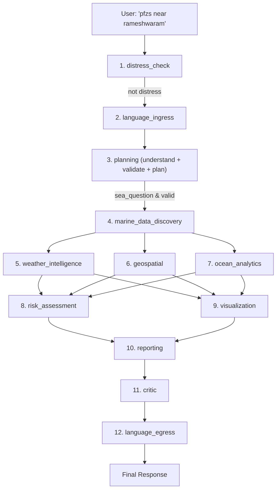

# ORCA Agentic Pipeline — End-to-End Walkthrough

> **Example prompt:** `"pfzs near rameshwaram"`
> **Pipeline:** 15 nodes in LangGraph (9 active for standard sea query), ~3-4 LLM calls, ~5-10 seconds

---

## The Full Flow



---

## Step-by-Step: What Happens to "pfzs near rameshwaram"

### 1. `distress_check` — Agent 12
**File:** [distress.py](file:///c:/Users/Abhay%20S%20R/Desktop/orca/backend/orca/agents/distress.py)
**LLM calls:** 0 or 1

**What it does:**
- Runs FIRST, before anything else — a garbled, place-less message is exactly what someone in trouble sends
- **Step A — Phrase list scan (deterministic):** Checks the raw text against `_DISTRESS_PATTERNS` — ~17 English phrases + phrases in Tamil, Hindi, Telugu, Malayalam, Kannada, Bengali, Marathi (e.g., "sinking", "mayday", "capsized", "sos", "மூழ்குகிறது")
- Also checks `_MEDICAL_PATTERNS` (~64 phrases like "bleeding", "fracture", "unconscious")
- **Step B — LLM escalate-only check (Revamp §7.4):** If the phrase list did NOT trigger, sends the text to a cheap-tier LLM asking "is this a distress call?" Can ONLY escalate (set distress=true), NEVER de-escalate
- Also looks up the nearest MRCC (Maritime Rescue Coordination Centre) contact based on user location

**For "pfzs near rameshwaram":**
- No distress phrase matched → LLM check runs → model says "no, this is about fishing zones" → `is_distress = false`
- **Passes through** to next node

**Deterministic lists used:**
- `_DISTRESS_PATTERNS` — 7 languages × ~10-17 phrases each
- `_MEDICAL_PATTERNS` — ~64 phrases
- `_ROMANISED_DISTRESS` — romanised Tamil/Hindi distress phrases

---

---

### 2. `language_ingress` — Agent 1 (Translation In)
**File:** [language.py](file:///c:/Users/Abhay%20S%20R/Desktop/orca/backend/orca/agents/language.py)
**LLM calls:** 0 (translation is a separate ML model, not an LLM)

**What it does:**
- **Language detection (deterministic):** Checks Unicode script blocks — Tamil (0x0B80-0x0BFF), Hindi/Marathi (Devanagari 0x0900-0x097F), Telugu, Malayalam, Kannada, Bengali, Gujarati, Odia. Disjoint blocks = exact detection
- **Translation to English:** If not English, translates via Bhashini API (or local IndicTrans2 200M model)
- Sets `normalized_english_query` and `detected_language` in state

**For "pfzs near rameshwaram":**
- All Latin characters → `detected_language = "en"`
- Already English → `normalized_english_query = "pfzs near rameshwaram"` (unchanged)
- **No translation needed**

**Deterministic lists used:**
- `_SCRIPT_BLOCKS` — Unicode ranges for 9 Indic scripts
- `_FLORES_200_CODES` — language codes for Bhashini/IndicTrans2

---

### 3. `planning` — Agent 2 (Unified Planning, Understanding & Validation)
**File:** [planning.py](file:///c:/Users/Abhay%20S%20R/Desktop/orca/backend/orca/agents/planning.py) & [understand.py](file:///c:/Users/Abhay%20S%20R/Desktop/orca/backend/orca/agents/understand.py)
**LLM calls:** 1 (cheap tier)

**What it does (consolidated in Phase PC2):**
- **LLM Prompt Understanding:** Sends the message + conversation history + user location + clock to a cheap-tier LLM. The model returns structured understanding:
```json
{
  "kind": "sea_question",
  "intents": ["PFZ_NEAREST"],
  "places": [{"raw": "rameshwaram", "normalized": "Rameswaram"}],
  "when": null,
  "planned_agents": ["ocean_analytics", "geospatial", "visualization"],
  "is_followup": false
}
```
- **Folded Validation (`validate_reading`):** Replaces the old standalone `query_guard` node. Checks resolved places (ambiguous/unresolvable → `NEEDS_PLACE`), horizon limits (past or >7-day forecast → `OUT_OF_RANGE`), and coastline position. Refusals set `query_outcome` and route immediately to `END`.
- **Execution Plan Generation:** If `kind` is non-sea (greeting, off-topic), routes to `out_of_scope`. For `sea_question`, validates intents against `ROUTING_TABLE` (19 rows) and computes `execution_plan` (e.g. `["marine_data_discovery", "ocean_analytics", "geospatial", "visualization"]`).

**For "pfzs near rameshwaram":**
- LLM understands "pfzs" = plural of "PFZ" (Potential Fishing Zone), resolves "rameshwaram" to "Rameswaram"
- Validation checks out: Rameswaram is in the gazetteer, position is coastal, no out-of-range horizon
- Generates `execution_plan = ["marine_data_discovery", "ocean_analytics", "geospatial", "visualization"]`
- **Routes to** `marine_data_discovery`

**Deterministic lists and helpers used:**
- `place_resolution.validate_reading()` — validates place resolution and 7-day time horizon
- `ROUTING_TABLE` — 19 rows × keywords × specialist agent assignments
- `_fallback_understand()` — offline fallback if LLM is unavailable (~136 marine terms, ~20 non-marine terms, 14 injection patterns)

---

### 4. `marine_data_discovery` — Agent 3 (Source Selection)
**File:** [discovery.py](file:///c:/Users/Abhay%20S%20R/Desktop/orca/backend/orca/agents/discovery.py)
**LLM calls:** 0

**What it does:**
- Has a **catalog of 25+ data sources** (INCOIS, MOSDAC, Copernicus CMEMS, IMD, etc.)
- Each source has: authority tier (TIER1/2/3), freshness, coverage area, data types it serves
- For the query's intents, picks the best source per data type:
  - Compares authority tier → freshness → availability
  - Has fallback cascades (if MOSDAC is down, try Copernicus)
- Outputs a **comparison narrative**: "INCOIS OSF PFZ chosen over X because..."
- This decision is made ONCE and shared with all three specialist agents

**For "pfzs near rameshwaram":**
- Intent is PFZ_NEAREST → needs: PFZ data, SST, chlorophyll, bathymetry
- Selects: INCOIS OSF for PFZ advisories, MOSDAC for SST, etc.
- Writes: `discovery_sources` with rationale

**Deterministic data used:**
- `_CATALOG` — 25+ DataSource entries with authority/freshness/coverage
- `_FALLBACK_CASCADES` — ordered fallback chains per data type
- `PFZ_FALLBACK_FILE` — a GeoJSON file with fallback PFZ data for the pilot region

---

### 5-7. Three Specialists (run in PARALLEL)

#### 5. `weather_intelligence` — Agent 4
**File:** [weather_intelligence.py](file:///c:/Users/Abhay%20S%20R/Desktop/orca/backend/orca/agents/weather_intelligence.py) (39KB)
**LLM calls:** 0

- Fetches live weather data for Rameswaram's coordinates from the sources Agent 3 selected
- Returns: wind speed/direction, wave height (Hs), swell period, SST, visibility, IMD warnings
- Uses `_TEMPORAL_PATTERNS` for time parsing (today/tomorrow/tonight)
- Has `_WATER_BODY_WORDS` for water-body-specific adjustments

#### 6. `geospatial` — Agent 6
**File:** [geospatial.py](file:///c:/Users/Abhay%20S%20R/Desktop/orca/backend/orca/agents/geospatial.py) (40KB)
**LLM calls:** 0

- Computes distances to: IMBL (India-Sri Lanka maritime boundary), Marine Protected Areas, coastline
- Loads actual GeoJSON shapefiles for boundaries
- For PFZ: finds nearest Potential Fishing Zones from INCOIS advisories
- Returns: distance to nearest PFZ, bearing, boundary distances, MPA proximity

**Deterministic data used:**
- GeoJSON shapefiles: India EEZ, Sri Lanka EEZ, Gulf of Mannar MPA, state coastlines
- `_GAZETTEER` — 249 coastal places with lat/lon
- `_REGION_KEYS` — 28 coastal state/UT identifiers
- `_COASTAL_STATES` — 13 Indian coastal states

#### 7. `ocean_analytics` — Agent 5
**File:** [ocean_analytics.py](file:///c:/Users/Abhay%20S%20R/Desktop/orca/backend/orca/agents/ocean_analytics.py) (85KB — the largest agent)
**LLM calls:** 0

- The "DEEP" agent — tide prediction, PFZ persistence analysis, sector status, catch-decline diagnosis
- For PFZ queries: analyzes PFZ persistence (is this zone consistently productive?), OSF point forecast
- Computes: tide windows, upwelling indicators, SST stress zones
- Has the sector-by-sector catch analysis logic

**Deterministic data used:**
- `_HISTORICAL_DAYS_BACK` — how far back to look for persistence
- SST stress thresholds, upwelling indicators
- `_PROTECTED_TERM` — terms for marine protected areas

---

### 8. `risk_assessment` — Agent 7 (Safety Verdict)
**File:** [risk_assessment.py](file:///c:/Users/Abhay%20S%20R/Desktop/orca/backend/orca/agents/risk_assessment.py)
**LLM calls:** 0 (NEVER — this is life-safety code)

**What it does:**
- Takes weather + ocean data and produces the **GO / CAUTION / NO_GO** verdict
- Pure math against documented thresholds from Architecture §3.1:
  - Wind > 45 km/h → NO_GO
  - Wave height > 2.5m → NO_GO
  - Visibility < 1km → CAUTION
  - etc.
- Adjusts thresholds by vessel class (small fishing boat vs trawler vs cargo)
- Uses `reconcile.py` when two data sources disagree on the same variable

**For "pfzs near rameshwaram":**
- Reads weather data → applies thresholds → e.g., "GO — conditions are safe"
- Reconciles if MOSDAC says wind=20 km/h but CMEMS says wind=25 km/h

**Deterministic data used:**
- `_VESSEL_DELTAS` — threshold adjustments per vessel class
- Hard-coded safety bands from Architecture §3.1 (wind, wave, visibility, etc.)
- `conservative_or()` — when data is missing, assumes the worse case

---

### 9. `visualization` — Agent 8 (Maps & Charts)
**File:** [visualization.py](file:///c:/Users/Abhay%20S%20R/Desktop/orca/backend/orca/agents/visualization.py)
**LLM calls:** 0

**What it does:**
- Shapes the weather/geospatial/ocean data into map layers and charts for the frontend
- Creates: PFZ markers, boundary polygons, wind rose charts, wave height time series, heatmaps
- Validates every GeoJSON geometry with Shapely before sending

**For "pfzs near rameshwaram":**
- Creates PFZ point markers on the map
- Adds boundary polygons (IMBL, MPA)
- Creates a wind/wave time series chart

---

### 10. `reporting` — Agent 9 (Write the Answer)
**File:** [reporting.py](file:///c:/Users/Abhay%20S%20R/Desktop/orca/backend/orca/agents/reporting.py)
**LLM calls:** 1 (mid tier — the most important call)

**What it does:**
- Assembles all agent outputs into one coherent response
- Creates citations (every number carries: dataset name + timestamp)
- Sends everything to a **mid-tier LLM** (Groq → Gemini → Ollama fallback chain) with a narrative prompt
- The LLM writes a conversational response around the data, keeping the GO/CAUTION/NO_GO verdict header intact
- Adjusts tone by persona (fisherman gets simple language, researcher gets technical)

**For "pfzs near rameshwaram":**
- LLM receives: safety verdict, PFZ locations + distances, weather conditions, boundary distances
- Writes something like: "**✅ GO — Safe to venture out.** There are 2 active fishing zones near Rameswaram. The nearest PFZ is 23 km southeast, bearing 142°. Wind is 15 km/h from the northeast, wave height 0.8m. The IMBL is 45 km away — stay well within it."

**Deterministic data used:**
- `_guard_prompt` — system prompt for guard replies (with Rule 6: must keep the REASON sentence)
- `_narrative_prompt` — system prompt for full narrative responses
- Citation builder — links every number to its data source

---

### 11. `critic` — Agent 10 (LLM-as-Judge)
**File:** [critic.py](file:///c:/Users/Abhay%20S%20R/Desktop/orca/backend/orca/agents/critic.py)
**LLM calls:** 1 (reasoning tier)

**What it does:**
- Runs on EVERY query (not just DEEP ones)
- Reviews the reporting narrative against a rubric:
  - Does the verdict match the data?
  - Are all cited numbers actually in the agent outputs?
  - Is the response in the right language?
  - Did it keep the safety verdict header?
- If it finds an issue, can send the answer back to one specialist agent for re-invocation (max 1 loop)
- **Cannot alter the GO/NO_GO verdict** — only the explanatory prose

**For "pfzs near rameshwaram":**
- Reads the narrative, checks numbers against agent outputs
- Likely passes → no re-invocation needed

---

### 12. `language_egress` — Agent 1 (Translation Out)
**File:** [language.py](file:///c:/Users/Abhay%20S%20R/Desktop/orca/backend/orca/agents/language.py)
**LLM calls:** 0 (translation model, not LLM)

**What it does:**
- If the user's detected language was not English, translates the final response back to their language
- Uses Bhashini API or local IndicTrans2 model (English → target language)
- Sets `final_vernacular_response`

**For "pfzs near rameshwaram":**
- User language was English → no translation → `final_vernacular_response = final_english_response`

---

## Summary Table

| # | Node | Agent | LLM? | What it does | Key deterministic data |
|---|---|---|---|---|---|
| 1 | distress_check | 12 | 0-1 | Pattern-match distress phrases, LLM escalate-only | ~150 phrases in 7 languages |
| 2 | language_ingress | 1 | 0 | Detect script, translate to English | Unicode block ranges |
| 3 | **planning** | 2 | **1** | LLM reads prompt & intents + validates place/horizon + builds plan | `ROUTING_TABLE`, `validate_reading`, fallback word lists |
| 4 | marine_data_discovery | 3 | 0 | Pick best data sources | 25+ source catalog with fallback chains |
| 5 | weather_intelligence | 4 | 0 | Fetch live weather/wave/wind | API clients, temporal patterns |
| 6 | geospatial | 6 | 0 | Compute distances/boundaries | GeoJSON shapefiles, 249-place gazetteer |
| 7 | ocean_analytics | 5 | 0 | PFZ persistence, tides, SST | Historical analysis, sector data |
| 8 | risk_assessment | 7 | 0 | **GO/CAUTION/NO_GO** verdict | Hard-coded safety thresholds |
| 9 | visualization | 8 | 0 | Map layers + charts | Shapely geometry validation |
| 10 | **reporting** | 9 | **1** | Write the conversational answer | Narrative prompt, citation builder |
| 11 | **critic** | 10 | **1** | Review answer quality | Rubric checklist |
| 12 | language_egress | 1 | 0 | Translate answer back | Bhashini/IndicTrans2 |

**Total LLM calls for this query: ~3-4** (planning + reporting + critic + maybe distress model check)
