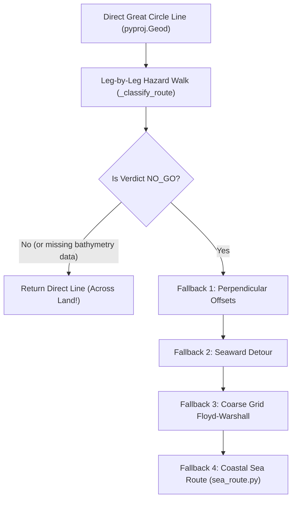
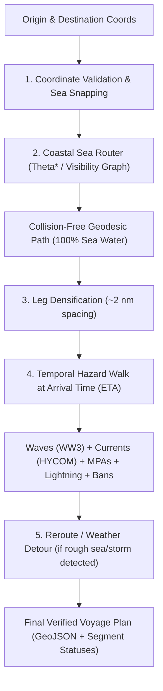

# Voyage Page Routing Architecture & Algorithm Specification

**Document Status**: Proposed Specification / Architecture Plan  
**Target Surface**: Sagar Sarathi (`frontend/app/voyage/page.tsx` & `backend/orca/agents/voyage.py`)  
**Scope**: Complete Redesign of Voyage Route Generation, Coastal Land Avoidance, and Weather-Optimized Routing.

---

## 1. Executive Summary

During testing of the **Plan a Voyage** interface (`/voyage`), routes between coastal points (e.g., Gujarat Coast/Porbandar `22.98° N, 70.22° E` to Lakshadweep Sea `11.08° N, 70.51° E`) were observed rendering as **straight Great Circle lines that cut directly across land** (the Kathiawar peninsula in Gujarat).

This document details:
1. **Root-Cause Analysis** of why land-crossing currently occurs in the `/api/voyage-plan` backend logic.
2. **Architecture Fixes** to invert the routing pipeline so that land avoidance is enforced *first*, before temporal hazard classification.
3. **Algorithm Selection & Technical Justification** for **Theta\* Any-Angle Pathfinding**, **Visibility Graphs**, and **Isochrone Weather Routing**, explaining why they are uniquely suited for Indian waters, small fishing vessels, and Coast Guard/SIH operational requirements.
4. **Step-by-Step Implementation Plan** for approval prior to code execution.

---

## 2. Current Architecture Audit & Root Cause

### 2.1 Why the Voyage Page Draws Lines Across Land

The current voyage generation pipeline in [`orca/agents/voyage.py`](file:///e:/ORCA/backend/orca/agents/voyage.py#L750-L950) operates using a **Fallback Cascade**:



#### Key Flaws Identified:
1. **Direct Line As Initial Assumption**: `plan_voyage()` begins by generating a direct straight line (`densify_route(origin, destination)`) across WGS84 geodesics.
2. **Bathymetry Dependency for Land Detection**: Land detection in `_classify_segment()` relies heavily on `depth_at_point()` querying the local GEBCO NetCDF grid. If GEBCO data is missing locally, unindexed, or returns `depth_m=None`, `on_land` defaults to `False`. The direct line is then marked `GO` or `CLEAR` and returned to the UI **without ever invoking land avoidance**.
3. **Disconnect Between `/api/sea-route` and `/api/voyage-plan`**: 
   - `/api/sea-route` ([`orca/sea_route/router.py`](file:///e:/ORCA/backend/orca/sea_route/router.py)) contains land polygons and grid-based routing, but is only called as **Fallback #4** inside `plan_voyage()`.
   - `/api/voyage-plan` handles temporal hazards (waves, currents, MPAs), but relies on `densify_route()` straight lines.

---

## 3. Proposed Fix: Inverted Routing Pipeline

To guarantee 100% land avoidance and robust voyage planning, the pipeline must be **inverted**:



### Core Architecture Principles:
1. **Land Avoidance First**: Never attempt hazard classification on a straight line. First compute a continuous, land-free sea track.
2. **Sea Point Validation**: If a user clicks on land (or near a jetty), automatically snap to the nearest navigable sea cell within 25 nm (or raise an interactive error if deep inland).
3. **Temporal Evaluation**: Evaluate wave height, ocean current set/drift, and lightning at the exact hour the vessel reaches each leg ($ETA = Departure + \sum \frac{dist}{speed}$).

---

## 4. Algorithm Selection & Technical Justification

To make Sagar Sarathi state-of-the-art for Indian maritime operations, we evaluate three complementary algorithms:

| Algorithm | Computational Complexity | Land Avoidance | Path Quality | Best Suited For |
|---|---|---|---|---|
| **Theta\* / Lazy Theta\*** | $O(E \log V)$ (sub-50ms) | Grid-based (100%) | Smooth, Any-Angle | **Primary Real-time Coastal Router** |
| **Visibility Graph + Spatial Index** | $O(V^2 \log V)$ precomputed | Geometric Exact (100%) | Optimal Euclidean | **Channel & Archipelago Passages** |
| **Isochrone Method (Weather Routing)** | $O(N \cdot T)$ | Grid + Cost Field | Fuel/Safety Optimal | **Monsoon Weather Detours** |

---

### Algorithm 1: Theta\* / Lazy Theta\* (Any-Angle Pathfinding)

#### How it Works:
Standard grid search (A\* or Dijkstra) restricts movement to 8 cardinal/intercardinal directions (0°, 45°, 90°), creating unnatural "staircase" or "zigzag" trajectories.  
**Theta\*** extends A\* by evaluating **Line-of-Sight (LOS)** between a parent node's predecessor and the target node:
$$\text{If } \text{LineOfSight}(parent(u), v) \text{ is Clear:}$$
$$g(v) = g(parent(u)) + c(parent(u), v), \quad parent(v) = parent(u)$$

```
Standard A* (Grid Zigzag):        Theta* (Direct Line-of-Sight Any-Angle):
  ┌───┐───┐                         ┌───────┐
  │   │ / │                         │  /    │
  ├───┼───┤                         ├───┼───┤
  │ / │   │                         │ /     │
  └───┴───┘                         └───┴───┘
```

#### Why it Suits Sagar Sarathi:
1. **Sub-50ms Performance**: Ideal for interactive web UI dragging and real-time map pin adjustments.
2. **Natural Coastal Navigation**: Naturally rounds headlands (e.g., Kanyakumari, Saurashtra Peninsula, Kathiawar) with clean, straight legs rather than jagged grid paths.
3. **Memory Efficient**: Runs directly on ORCA's existing 2D NumPy sea-land grid ([`orca/sea_route/grid.py`](file:///e:/ORCA/backend/orca/sea_route/grid.py)).

---

### Algorithm 2: Visibility Graph + Convex Hull Safety Buffer

#### How it Works:
1. Load high-resolution coastline polygons (Natural Earth / OpenStreetMap India coastline).
2. Apply a **2.0 nautical mile safety buffer** (standoff distance) around land geometries.
3. Construct a graph connecting all mutually visible convex vertices of the buffered polygons.
4. Perform A\* search on the pre-computed Visibility Graph.

```
       Land Mass
     ┌───────────┐
     │           │
   A ─ ─ ─ ─ ─ ─ ─ ─ ─ ─> (Direct line blocked by land)
   A ──────────> V1 ──────────> V2 ──────────> B (Visibility Graph around buffer)
```

#### Why it Suits Sagar Sarathi:
1. **Mathematical Guarantee**: Provides a 100% proof that the vessel will never breach coastal land or enter restricted naval zones (e.g., Pakistan IMBL, firing ranges).
2. **Critical for Small Fishing Crafts**: Traditional trawlers and motorboats operating off the Konkan or Coromandel coasts require explicit distance-from-shore safety margins to avoid shallow reefs.

---

### Algorithm 3: Modified Isochrone Method (Dynamic Weather & Current Routing)

#### How it Works:
For multi-day transits across open waters (e.g., Mumbai to Lakshadweep, Chennai to Port Blair), weather conditions change dynamically:
1. Construct time-fronts (isochrones) advancing outward every 3 hours.
2. For each heading, compute vessel speed over ground ($SOG$) incorporating:
   $$\vec{V}_{vessel} = \vec{V}_{engine} + \vec{V}_{HYCOM\_current}$$
   $$R_{wave} = f(H_s \text{ from WW3 forecast})$$
3. Expand isochrones until the destination front is reached.

#### Why it Suits Sagar Sarathi:
1. **Monsoon Safety**: Small fishing boats (8–12 knots) are severely vulnerable to 3m+ monsoon waves and strong cross-track beam currents (HYCOM).
2. **Fuel Savings**: Calculating current assist (sailing with ocean currents vs. fighting head-currents) provides actionable fuel burn estimates ($L/h$).

---

## 5. Unified System Design for Sagar Sarathi

```
                             [ User Request / API Endpoint ]
                                           │
                                           ▼
                       [ Step 1: Validate & Snap Coordinates ]
                       (Verify inside India BBox & Sea Water)
                                           │
                                           ▼
                      [ Step 2: Coastal Route Generation ]
                     (Theta* + Line-of-Sight Land Pruning)
                                           │
                                           ▼
                      [ Step 3: Leg Densification & ETA Walk ]
                     (Densify to ~2nm legs, calculate leg ETAs)
                                           │
                                           ▼
                   [ Step 4: Multi-Hazard Temporal Classifier ]
       ┌───────────────────┬───────────────────┼───────────────────┐
       ▼                   ▼                   ▼                   ▼
 Bathymetry &       WW3 Waves &         HYCOM Surface       MPAs & Fishing
 Shallow Draft      Wave Height         Current Drift        Seasonal Bans
       └───────────────────┴───────────────────┼───────────────────┘
                                           │
                                           ▼
                     [ Step 5: Overall Verdict & Payload ]
                     (GO / CAUTION / NO_GO + GeoJSON Corridor)
```

---

## 6. Detailed Implementation Roadmap

### Phase 1: Pipeline Integration (`backend/orca/agents/voyage.py`)
- Refactor `plan_voyage()` so that `sea_route()` from `orca/sea_route/router.py` is invoked as the **primary path generator** before running `_classify_route()`.
- Ensure fallbacks only run if extreme weather (e.g. `ROUGH_SEA` or `LIGHTNING`) blocks a specific sea leg.

### Phase 2: Router Engine Upgrade (`backend/orca/sea_route/`)
- Replace standard 8-neighbor grid search in [`orca/sea_route/warshall.py`](file:///e:/ORCA/backend/orca/sea_route/warshall.py) with **Theta\* Pathfinding** for smooth any-angle routing.
- Integrate STRtree land polygon checking directly into node expansion to ensure a minimum 1.8–2.0 nm standoff from land.

### Phase 3: Frontend Map & UI Integration (`frontend/app/voyage/`)
- Update `SeaRouteMap.tsx` and `page.tsx` to display color-coded leg segments:
  - 🟢 **Green**: Clear sea water.
  - 🟡 **Yellow**: Caution (tight depth clearance, strong cross currents).
  - 🔴 **Red**: Blocked (rough sea, active ban, MPA).
- Provide an interactive **Alternative Route Switcher** showing distance difference ($+NM$) and time difference ($+Hours$).

---

## 7. Next Steps & Action Required

1. **Review Architecture**: Please review this specification document.
2. **Feedback & Approval**: Provide any feedback or specific constraints regarding port gazetteers, safety buffer distances, or vessel classes.
3. **Execution**: Upon approval, implementation will proceed systematically according to the Phase 1–3 roadmap above.
