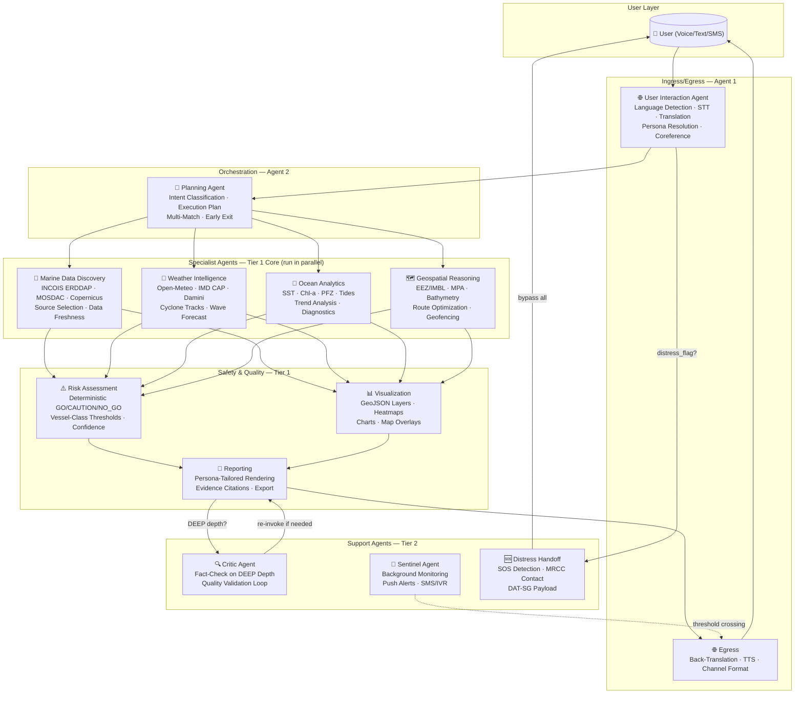

# 🌊 ORCA — Complete Implementation Plan

**Problem Statement:** SIH26176 (ISRO / Department of Space) · **Theme:** Disaster Management  
**Team Size:** 6 Members · **Pilot Region:** South Tamil Nadu (Thoothukudi–Rameswaram–Kanyakumari, Palk Bay & Gulf of Mannar)  
**Target Stack:** LangGraph + FastAPI (Python 3.11) + Next.js/Leaflet  
**Data Collected:** 98 files, 18.72 GB, 25/25 datasets verified ✅  

---

## Architecture Overview



---

## Team Member Roles & Responsibilities

| ID | Role Title | Primary Ownership | Key Deliverables |
|:---:|:---|:---|:---|
| **M1** | **Backend Lead & Agent Orchestrator** | LangGraph pipeline, Planning Agent (A2), State Schema (`ORCAState`), API server (FastAPI), Redis caching, inter-agent contracts | Working orchestration graph, intent routing table, parallel fan-out, multi-match/no-match handling, cost-based early exit |
| **M2** | **Marine Data & Ocean Analytics Engineer** | Marine Data Discovery (A3), Ocean Analytics (A5), data ingestion/parsing pipelines | ERDDAP/MOSDAC/Copernicus connectors, PFZ parser, SST/Chl-a analysis, tide integration, productivity diagnostics, data freshness tracking |
| **M3** | **Weather, Safety & Risk Engineer** | Weather Intelligence (A4), Risk Assessment (A7), Distress Handoff (A12) | Deterministic safety engine, weather API integrations, cyclone/lightning/hazard alerting, vessel-class thresholds, GO/CAUTION/NO_GO logic, SOS detection |
| **M4** | **Geospatial & Visualization Engineer** | Geospatial Reasoning (A6), Visualization (A8), Sentinel background monitor (A11) | Boundary proximity checks, route optimization, bathymetry-aware navigation, GeoJSON layer generation, heatmaps, Leaflet map integration, push alert system |
| **M5** | **Frontend & UI/UX Lead** | Next.js frontend, Leaflet map UI, persona-specific rendering, trace panel, responsive design, mobile-first layout | Chat interface, interactive map, agent trace visualization, persona selector, GO/CAUTION/NO_GO banners, charts (Chart.js), accessibility |
| **M6** | **Language, Voice & Reporting Engineer** | User Interaction Agent (A1), Reporting Agent (A9), Critic Agent (A10), multilingual pipeline | Bhashini/IndicTrans2 integration, STT/TTS pipeline, persona resolution, multi-turn conversation memory, evidence citation engine, persona-tailored output formatting |

---

## Phase 0 — Foundation & Environment Setup (Days 1–2)

> [!IMPORTANT]
> **Hard gate:** All team members must have their local dev environment working before Phase 1 begins. Data layer verification is a blocker for everything downstream.

### All Members (Day 1 — Morning)

- [ ] Clone repo, set up Python 3.11 virtual environment
- [ ] Install core dependencies: `langgraph`, `langchain`, `fastapi`, `uvicorn`, `geopandas`, `shapely`, `xarray`, `netCDF4`, `rioxarray`, `redis`, `httpx`
- [ ] Set up Node.js 18+ for Next.js frontend
- [ ] Configure `.env` with API keys (Open-Meteo, Stormglass, Copernicus, GFW, Bhashini)
- [ ] Verify PostgreSQL + PostGIS is running locally (or use Docker)

---

### M1 — Backend Foundation

| Task | Details | Files/Output |
|:---|:---|:---|
| Initialize FastAPI project structure | Create `backend/` with `main.py`, `routers/`, `agents/`, `models/`, `tools/`, `config/` | `backend/main.py` |
| Define `ORCAState` TypedDict | Implement the full state schema from Architecture §5 | `backend/models/state.py` |
| Define inter-agent JSON contract | Dataclass for `AgentResult` with `source_provenance`, `confidence` | `backend/models/contracts.py` |
| Set up Redis connection | TTL-based caching layer, source-cadence-aware config | `backend/config/cache.py` |
| Set up PostgreSQL + PostGIS | Session history, audit trace log, user registry tables | `backend/db/schema.sql` |

### M2 — Data Layer Verification

| Task | Details | Files/Output |
|:---|:---|:---|
| Verify all 98 data files load correctly | Parse every NetCDF, HDF5, GeoJSON, CSV, JSON in `data/` | `scripts/verify_data.py` |
| Build data manifest registry | Machine-readable index of all datasets with paths, schemas, update cadences | `backend/config/data_manifest.json` |
| Verify INCOIS ERDDAP endpoint | Test `erddap.incois.gov.in` with pinned cert at `certs/incois_cert.pem` | `scripts/test_erddap.py` |
| Parse MOSDAC NetCDF/HDF5 files | Load OCM-3 Chl-a (10 `.nc`), INSAT-3DR SST (17 `.h5`), ScatSat Winds (11 `.nc`) | `backend/tools/mosdac_parser.py` |
| Parse PFZ advisory HTML/JSON | Extract 318 PFZ nodes from `data/incois_osf_pfz/pfz/` | `backend/tools/pfz_parser.py` |

### M3 — Weather & Safety Data Verification

| Task | Details | Files/Output |
|:---|:---|:---|
| Test Open-Meteo Marine API | Verify wave height, swell, currents for Thoothukudi (8.80°N, 78.14°E) | `scripts/test_openmeteo.py` |
| Parse NDMA SACHET CAP alerts | Load 81 alerts from `data/tier1/hazards/ndma_cap_alerts.json` | `backend/tools/cap_parser.py` |
| Parse lightning nowcast data | Load 5-port lightning strike probability files | `backend/tools/lightning_parser.py` |
| Define safety threshold constants | Deterministic thresholds from Architecture §3.1 Agent 7 | `backend/config/safety_thresholds.py` |

### M4 — Geospatial Data Verification

| Task | Details | Files/Output |
|:---|:---|:---|
| Load & index EEZ/IMBL polygons | Parse `india_eez_polygon.geojson` (3.09 MB) + `srilanka_eez_polygon.geojson` (2.35 MB) | `backend/tools/boundary_loader.py` |
| Load & index MPA polygons | Parse `india_marine_mpas.geojson` (Gulf of Mannar + 9 others) | Same as above |
| Load GEBCO bathymetry grid | Parse `gebco_2026_n10.5_s7.5_w77.5_e80.5.nc` (720×720 grid at 15" resolution) | `backend/tools/bathymetry_loader.py` |
| Load INCOIS WW3 + HYCOM | Parse the 16.4 GB NetCDF forecasts, build sub-setting utilities | `backend/tools/incois_model_parser.py` |

### M5 — Frontend Foundation

| Task | Details | Files/Output |
|:---|:---|:---|
| Initialize Next.js project | `npx -y create-next-app@latest ./frontend` with TypeScript, App Router | `frontend/` |
| Set up design system | Color tokens, typography (Inter/Outfit), dark mode, glassmorphism variables | `frontend/app/globals.css` |
| Set up Leaflet map component | Base map centered on South Tamil Nadu pilot region | `frontend/components/Map.tsx` |
| Set up WebSocket/SSE connection | For streaming agent responses from FastAPI | `frontend/lib/api.ts` |

### M6 — Language Pipeline Setup

| Task | Details | Files/Output |
|:---|:---|:---|
| Test Bhashini API connectivity | Language detection, NMT (English ↔ Tamil/Hindi/Telugu/Malayalam) | `scripts/test_bhashini.py` |
| Set up IndicTrans2 local fallback | Download model, verify offline translation works | `backend/tools/translation.py` |
| Set up Whisper local fallback | Download `whisper-medium`, test Tamil/Hindi STT accuracy | `backend/tools/stt.py` |
| Define multilingual distress keyword list | Maritime distress terms in Tamil, Telugu, Hindi, Malayalam, Kannada, English | `backend/config/distress_patterns.json` |

---

## Phase 1 — Core Safety Path: "Is It Safe?" (Days 3–7)

> [!IMPORTANT]
> **Goal:** End-to-end fisherman safety query working — from Tamil voice input to GO/CAUTION/NO_GO verdict with map visualization. This is the **single most important demo flow** and must work perfectly.

### M1 — LangGraph Orchestration Engine

| Task | Details |
|:---|:---|
| Build LangGraph skeleton graph | `Ingress → Planning → [WIA, GRA] (parallel) → RAA → Visualization → Reporting → Egress` |
| Implement Planning Agent (A2) | Intent classification using the §4 routing table (rule-based first, embedding fallback) |
| Implement `classify_intent` tool | Match against 12 intent rows, return `(intent_row, confidence)` list |
| Implement `generate_execution_plan` | Deterministic composition: read matched rows → build parallel/sequential agent dispatch |
| Implement `reasoning_depth` logic | Default from persona, push up on complexity detection |
| Wire parallel fan-out | WIA + GRA + OAA run simultaneously using LangGraph branching |
| Implement multi-match union resolution | When query matches multiple intent rows, activate union of agents |
| Implement no-match fallback | Default path: Discovery + Weather + OAA, explicit "closest interpretation" message |

### M2 — Ocean Analytics Core (A5)

| Task | Details |
|:---|:---|
| Implement `analyze_pfz_proximity` | Input: (lat, lon, date) → nearest PFZ from 318 advisory nodes, distance + bearing |
| Implement `get_sst_snapshot` | Extract SST grid from HYCOM NetCDF / MOSDAC HDF5 for target bbox |
| Implement `get_chlorophyll_snapshot` | Extract Chl-a from MOSDAC OCM-3 NetCDF for target bbox |
| Implement `get_tide_prediction` | Lookup from `soi_tide_tables_2026.csv` (189 predictions, 5 ports), Stormglass fallback |
| Implement `select_best_source` | Priority cascade: MOSDAC NRT (same-day) > INCOIS ERDDAP > Copernicus (historical) |
| Implement data freshness tracking | `check_data_freshness` tool: compare acquisition timestamp against source cadence |

### M3 — Weather Intelligence (A4) + Risk Assessment (A7) + Distress (A12)

| Task | Details |
|:---|:---|
| Implement `get_marine_weather` | Open-Meteo Marine API call for wave height, wind, swell, currents (hourly forecast) |
| Implement `get_cyclone_status` | Parse NDMA SACHET CAP alerts, check for active Bay of Bengal / Arabian Sea cyclones |
| Implement `get_lightning_nowcast` | Load lightning strike probability from cached Damini nowcast data (5 ports) |
| Implement `get_incois_hazard_alerts` | Parse INCOIS multi-hazard bulletins (swell surge, Kallakkadal, high wave) |
| Implement `resolve_temporal_expression` | Rule-based: "tomorrow morning" → ISO datetime range (06:00-12:00 IST next day) |
| **Implement `evaluate_marine_safety`** | **THE critical function** — deterministic, rule-based, per Architecture §3.1 Agent 7 |
| Implement vessel-class threshold deltas | `small_fishing` (base), `mechanized_trawler` (+0.5m Hs, +9.3 km/h wind), `cargo_vessel` (+1.5m, +27.8 km/h) |
| Implement 3-tier confidence scoring | HIGH (govt source + <6h + full coverage), MEDIUM (global model + <24h), LOW-DATA (incomplete) |
| **Implement `detect_distress_signal`** | **Pattern-match against multilingual distress term list — deterministic, not LLM** |
| Implement `surface_mrcc_contact` | Static lookup: MRCC Tuticorin, Chennai, Kochi contact numbers + VHF channels |
| Implement `emit_datsg_handoff` | Structured CAP-compatible payload: position, vessel_id, distress_type, timestamp |

> [!CAUTION]
> `evaluate_marine_safety` is **pure Python math, never LLM-generated**. This is Architecture Principle 3 — a non-negotiable safety constraint.
>
> ```python
> def evaluate_marine_safety(wave_height_m, wind_speed_kmh, lightning_active,
>                            cyclone_alert, imbl_distance_nm, mpa_violation):
>     if cyclone_alert in ["Red", "Orange"] or wave_height_m >= 3.5 or wind_speed_kmh >= 55:
>         return {"status": "DANGER", "go_no_go": "NO_GO", "reason": "Severe Weather"}
>     if lightning_active:
>         return {"status": "DANGER", "go_no_go": "NO_GO", "reason": "Active Lightning"}
>     if imbl_distance_nm <= 1.0 or mpa_violation:
>         return {"status": "CRITICAL_GEOFENCE", "go_no_go": "NO_GO", "reason": "Boundary Breach"}
>     if 2.0 <= wave_height_m < 3.5 or 35 <= wind_speed_kmh < 55 or imbl_distance_nm <= 3.0:
>         return {"status": "WARNING", "go_no_go": "CAUTION", "reason": "Rough Sea State"}
>     return {"status": "SAFE", "go_no_go": "GO", "reason": "All Parameters Within Safe Limits"}
> ```

### M4 — Geospatial Reasoning (A6)

| Task | Details |
|:---|:---|
| Implement `check_boundary_proximity` | GeoPandas/Shapely: distance from (lat, lon) to nearest EEZ/IMBL/MPA edge (in NM) |
| Implement `point_in_polygon` | Check if user position is inside any restricted polygon (EEZ, MPA, territorial waters) |
| Implement `spatial_query_zones` | Query which geofence zones a bbox intersects |
| Implement `generate_map_layers` | Produce GeoJSON FeatureCollections for Leaflet rendering per layer type |
| Build South Tamil Nadu geospatial index | Pre-index EEZ, MPA, bathymetry for the pilot region for fast queries |

### M5 — Chat UI + Map + Safety Banners

| Task | Details |
|:---|:---|
| Build chat interface component | Message bubbles, typing indicator, streaming response rendering |
| Build GO / CAUTION / NO_GO banner component | Large, colored, icon-based — green (GO), amber (CAUTION), red (NO_GO) |
| Build interactive Leaflet map panel | User position marker, PFZ markers, EEZ/IMBL boundary overlays, MPA polygons |
| Build split-pane layout | Left: chat panel with voice input button · Right: interactive map |
| Build persona selector | Dropdown/tabs: 🐟 Fisherman, 🚢 Operator, 🔬 Researcher, 🚨 Authority |
| Implement SSE streaming | Progressive rendering: show map + weather first, then safety verdict badge |
| Build mobile-responsive layout | Cards stack vertically on mobile, map goes full-width |
| Build LOW-DATA amber treatment | Distinct amber "Data limited — verify locally" banner when confidence is LOW-DATA |

### M6 — Language Pipeline + Basic Reporting

| Task | Details |
|:---|:---|
| Implement `detect_language` tool | fastText-based language ID (or Bhashini LangID), return ISO 639-1 code + confidence |
| Implement `speech_to_text` tool | Bhashini ASR → Whisper fallback chain |
| Implement `translate_to_english` | IndicTrans2 / Bhashini NMT for ingress |
| Implement `translate_from_english` | IndicTrans2 / Bhashini NMT for egress |
| Implement `resolve_persona` tool | Rule cascade: explicit UI selection → registered profile → zero-shot classifier |
| Implement `text_to_speech` tool | Bhashini TTS / Google Cloud TTS fallback, Tamil + Hindi priority |
| Build fisherman reporting template | SimpleCard: icon, 2-line summary, GO/CAUTION/NO_GO badge, map pin |
| Build evidence citation engine | Attach `source_provenance` (dataset name, timestamp, freshness) to every claim |

### Phase 1 Integration Test (Day 7)

> [!TIP]
> **End-to-end test query:** *"நாளை காலையில் கடலுக்கு போவது பாதுகாப்பானதா?"* (Tamil: "Is it safe to go to sea tomorrow morning?")
>
> **Expected flow:** Tamil voice → STT → translate → Planning (safety intent) → Weather + Geospatial (parallel) → Risk Assessment → GO/CAUTION/NO_GO → Visualization (map) → Reporting (fisherman card) → translate → TTS → Tamil voice response

---

## Phase 2 — Full Agent Coverage & Multi-Intent (Days 8–14)

### M1 — Advanced Orchestration

| Task | Details |
|:---|:---|
| Wire all 9 core agents into LangGraph | Complete graph with conditional edges for all 12 intent rows |
| Implement cost-based early exit (§9.3) | If WIA+GRA → NO_GO, cancel pending non-safety agents |
| Implement speculative parallel dispatch (§9.4) | Fire WIA/GRA/OAA in parallel, early-cancel on NO_GO |
| Implement semantic query caching (§9.1) | Vector-embed normalized query + bbox + time → serve cached if near-duplicate |
| Implement content-addressable MDD cache (§9.11) | Cache key = `(source, dataset_id, bbox_hash, time_window, params_hash)` |
| Build API endpoints | `POST /chat`, `POST /voice`, `GET /session/{id}`, `GET /trace/{query_id}` |
| Implement session history & multi-turn | Store prior turns, enable `resolve_coreference` for follow-up queries |

### M2 — Marine Data Discovery (A3) + Advanced Ocean Analytics

| Task | Details |
|:---|:---|
| Implement full MDD catalog routing | Narratable source selection: MOSDAC NRT for same-day → Copernicus for historical |
| Implement `fetch_erddap_dataset` | Live ERDDAP query with SSL cert pinning (`certs/incois_cert.pem`) |
| Implement `fetch_mosdac_product` | Parse MOSDAC OCM-3 Chl-a, INSAT-3DR SST, ScatSat Winds from local NetCDF/HDF5 |
| Implement `fetch_copernicus_sst` | CMEMS API query for global SST reanalysis (0.05° resolution) |
| Implement `fetch_catch_statistics` | Parse `datagov_marine_fish_landings.csv` for district/year catch trends |
| Implement `compute_sst_chl_trend` | Time-series analysis: SST + Chl-a trend line + anomaly flags from ERA5 baseline |
| Implement `diagnose_productivity_decline` | Multi-factor: correlate SST trend + Chl-a trend + catch stats for causal analysis |
| Implement `score_pfz_persistence` | Score (0-1) from recent advisory history: how often does a sector report PFZ? |

### M3 — Weather Failover & Cross-Source Validation

| Task | Details |
|:---|:---|
| Implement per-source failover chain | Open-Meteo → IMD API → Stormglass → cached data (per §12.1) |
| Implement circuit breaker (§9.8) | Background health pings per source; trip before user query fails |
| Implement cross-source consistency check (§9.12) | If SST from ERDDAP vs. Copernicus differ >1°C → report both, flag, downgrade to MEDIUM |
| Implement degraded response contract | All-sources-down: serve stale cache + force LOW-DATA amber treatment |
| Parse INCOIS WW3 wave forecasts | Subset the 6.43 GB NetCDF for pilot region wave height/direction/period |
| Parse INCOIS HYCOM ocean model | Subset the 9.86 GB NetCDF for SST, currents, SSH, MLD |

### M4 — Route Optimization + Visualization Engine

| Task | Details |
|:---|:---|
| Implement `compute_safe_route` | Straight-line-buffered fallback: origin → destination, avoid geofence + shallow polygons |
| Implement A* bathymetry-aware routing (stretch) | Dijkstra on GEBCO depth grid: avoid <5m depth, avoid MPA, avoid IMBL buffer |
| Implement safety-gradient route coloring | Green/amber/red segments based on wave height along route |
| Build GeoJSON layer generator | PointMarker, Polygon, Polyline, Heatmap for all map layer types (§11.1) |
| Build SST heatmap layer | Render SST grid as a color-gradient overlay on Leaflet |
| Build Chl-a heatmap layer | Render chlorophyll concentration as green-gradient overlay |
| Build PFZ marker layer | PointMarkers for all 318 PFZ advisory nodes with bearing + distance labels |
| Build boundary overlay layers | EEZ/IMBL polygon outlines (dashed), MPA polygons (hatched fill) |
| Build route polyline layer | Safety-gradient-colored path with waypoint markers |

### M5 — Researcher & Authority Views

| Task | Details |
|:---|:---|
| Build researcher structured report view | Tables, time-series charts (Chart.js), methodology section, CSV/NetCDF export links |
| Build authority dashboard layout | District threat matrix tiles, alert cascade buttons, evacuation buffer overlays |
| Build operator route view | Route overlay on map, condition summary sidebar, ETA/fuel estimates |
| Build Chart.js integration | TimeSeries (SST/Chl-a/wave trends), BarChart (catch by district), WindRose |
| Build data export functionality | CSV, GeoJSON download buttons for researcher persona |
| Build persona correction affordance | One-tap "I'm actually a [Fisherman/Researcher/Authority/Operator]" control |
| Build agent execution trace panel | Real-time visualization of agent hand-offs: which agent ran, inputs, outputs, latency |

### M6 — Multi-Turn Conversation + Persona Rendering

| Task | Details |
|:---|:---|
| Implement `resolve_coreference` | "What about tomorrow?" → resolve bbox from session_history, update only time_window |
| Implement multi-turn session memory | Store/retrieve session_history in PostgreSQL |
| Build researcher reporting template | StructuredReport: statistical summary, full sensor metadata, citations, export links |
| Build authority reporting template | DashboardCard: summary tile, expandable detail, CAP-format alert payload |
| Build operator reporting template | OperationalBrief: route overlay, condition summary, ETA, safety badge |
| Implement `format_for_channel` | Template engine for 160-char SMS, IVR voice script, web chat card |
| Implement persona-specific depth defaults | fisherman=SHALLOW, operator=STANDARD, researcher=DEEP, authority=STANDARD |

### Phase 2 Integration Tests (Day 14)

Test all 8 PS query types end-to-end:

| # | Test Query | Expected Flow |
|:---:|:---|:---|
| 1 | "Where is the nearest PFZ today?" | MDD → OAA (pfz_proximity) → Viz (map markers) → Reporting |
| 2 | "Is it safe to venture into the sea tomorrow?" | WIA + GRA → RAA → GO/CAUTION/NO_GO → Viz + Reporting |
| 3 | "What are tide, weather, and sea conditions near Thoothukudi?" | MDD → WIA + OAA (tides) → Viz → Reporting |
| 4 | "Are there any cyclone alerts in my area?" | WIA (cyclone_status + hazard_alerts) → RAA → Reporting |
| 5 | "Which regions show high chlorophyll and favourable SST?" | MDD → OAA (sst + chl snapshots) → Viz (heatmaps) → Reporting |
| 6 | "What is the safest route from Thoothukudi to a PFZ?" | MDD + WIA + OAA → GRA (route) → RAA → Viz → Reporting |
| 7 | "Why has fish productivity declined near Rameswaram?" | MDD → OAA (diagnostic, STANDARD+ depth) → Reporting |
| 8 | "Which fishing zones should I avoid due to geofencing?" | GRA (boundary_proximity) → RAA → Viz (polygons) → Reporting |

---

## Phase 3 — Differentiation Features: Sentinel, Critic, Voice (Days 15–21)

### M1 — Sentinel Infrastructure + Alert System (A11)

| Task | Details |
|:---|:---|
| Implement Sentinel background loop | Async task: poll registered locations, check for verdict threshold crossings |
| Implement adaptive polling frequency (§9.17) | Near active cyclone → every few minutes; stable → hourly |
| Implement `list_monitored_locations` | Query user registry for all home ports / active vessel positions |
| Implement `get_last_broadcast_verdict` | Compare new vs. last-sent verdict for threshold crossing detection |
| Implement `dispatch_alert` | SMS gateway integration (Twilio/MSG91 for demo) for push alerts |
| Implement alert subscription intent | "Notify me if conditions change" → register Sentinel watch on resolved location |
| Implement priority lane (§9.10) | `SAFETY_CHECK` intent gets fast, resource-guaranteed lane under load |
| Implement request coalescing (§9.9) | Deduplicate concurrent identical `(bbox, time_window, intent)` requests |

### M2 — Bhuvan WMS Integration + Data Export

| Task | Details |
|:---|:---|
| Implement Bhuvan WMS tile overlay | Parse `bhuvan_manifest.json`, serve WMS tiles to Leaflet as raster overlay |
| Build data export pipeline | CSV, NetCDF, GeoJSON formatters for researcher persona downloads |
| Implement stale-while-revalidate caching (§9.14) | Non-safety data (SST, PFZ persistence) served from cache + background refresh |
| Implement predictive pre-computation (§9.2) | Run WIA+RAA for registered home ports on schedule → warm cache |

### M3 — Critic Agent (A10) + Historical Replay

| Task | Details |
|:---|:---|
| Implement Critic Agent validation rubric | 5-point check: factual consistency, temporal coherence, causal claim strength, citation, spatial accuracy |
| Implement `evaluate_response` tool | LLM-as-judge against structured rubric (only fires on `reasoning_depth == DEEP`) |
| Implement critic loop (max 3 iterations) | Re-invoke source agents on flagged issues, ship with disclaimer if not resolved |
| Implement async-upgrade rule for safety | Safety verdict emitted immediately; critic only reviews explanatory text asynchronously |
| Build Cyclone Gaja historical replay mode | Load historic IMD/MOSDAC data for Cyclone Gaja, replay through the pipeline |

### M4 — Proactive Geofencing + Advanced Visualization

| Task | Details |
|:---|:---|
| Implement proactive boundary monitoring | Register Sentinel watch for voyage duration; push alert on approach |
| Implement `precompute_geofence_grid` (§9.13) | Rasterize boundary exclusion zones for fast point-in-polygon during routing |
| Build distress marker layer | Non-dismissible red marker on authority dashboards for active SOS |
| Build Sentinel watch indicator | "Watching this boundary" badge on user's map view |
| Build WindRose chart component | Wind direction distribution visualization |
| Build RadarChart component | Multi-parameter safety score visualization for researcher/authority |

### M5 — Voice UI + Accessibility + Mobile Polish

| Task | Details |
|:---|:---|
| Build voice input button | Push-to-talk in chat interface, send audio blob to STT pipeline |
| Build audio response playback | Auto-play TTS response for fisherman persona |
| Build SOS emergency button | Prominent, always-visible red SOS button → triggers Agent 12 directly |
| Implement accessibility | High-contrast mode, screen-reader ARIA labels, keyboard navigation |
| Polish mobile responsive design | Test on Android Chrome, iOS Safari — fisherman's primary device |
| Build historical replay UI controls | Date picker + "Replay Cyclone Gaja" preset button |

### M6 — Full Multilingual + Regional Languages

| Task | Details |
|:---|:---|
| Extend language support | Tamil, Telugu, Malayalam, Kannada, Hindi, Bengali, Marathi, Gujarati, Odia, English |
| Test STT accuracy per language | Benchmark Whisper WER for Tamil/Telugu/Malayalam under noisy conditions |
| Test TTS quality per language | Verify Bhashini TTS pronunciation for coastal/nautical terminology |
| Build Sagar Vani-modeled SMS templates | 160-char regional language safety alert templates for each supported language |
| Implement IVR voice script generation | Structured voice call script for low-connectivity push alerts |
| Build CAP-format alert payload | Common Alerting Protocol XML for interoperability with government systems |

---

## Phase 4 — Optimization, Polish & Demo Preparation (Days 22–28)

### M1 — Performance & Observability

| Task | Details |
|:---|:---|
| Implement OpenTelemetry tracing (§9.18) | Instrument every agent node with spans: inputs, outputs, latency, provenance |
| Wire trace data to UI trace panel | Real-time agent hand-off visualization for judges |
| Implement hybrid intent classification (§9.5) | 3-tier cascade: rules → embedding similarity → LLM (only if needed) |
| Implement cost-tiered LLM cascade (§9.6) | Fast/cheap model for SHALLOW; strong model for DEEP + Critic |
| Load testing | Simulate 50 concurrent safety queries during mock cyclone scenario |
| Implement progressive/streaming response (§9.19) | Map + weather render first, safety badge last (never an ambiguous placeholder) |

### M2 — Diagnostic Demo Flow

| Task | Details |
|:---|:---|
| End-to-end diagnostic query | "Why has fish catch declined near Thoothukudi?" → SST + Chl-a + catch trends → Critic validates |
| Cross-source consistency demo | Show SST from ERDDAP vs. Copernicus disagreement → both reported, confidence downgraded |
| Data source selection narrative | Show visible trace of MDD choosing MOSDAC NRT over Copernicus for same-day query |

### M3 — Distress Demo + Safety Hardening

| Task | Details |
|:---|:---|
| End-to-end distress flow | Tamil voice SOS → pattern match → bypass all agents → MRCC contact + DAT-SG payload |
| Safety edge cases | Test: all sources down → stale cache + amber LOW-DATA treatment |
| Test conflicting sources | SST discrepancy → both reported, confidence downgraded |
| Test vessel-class variations | Same conditions: small_fishing=NO_GO, cargo_vessel=CAUTION |

### M4 — Sentinel + Geofencing Demo

| Task | Details |
|:---|:---|
| End-to-end Sentinel flow | Register watch → simulate position change → push alert on threshold crossing |
| Proactive IMBL approach demo | "Am I approaching the Sri Lanka boundary?" → 3.1 NM → CAUTION → Sentinel monitors → push alert at 0.4 NM |
| Route optimization demo | Safe route around Gulf of Mannar MPA + IMBL buffer with depth-aware waypoints |

### M5 — UI Polish & Demo Script

| Task | Details |
|:---|:---|
| Polish all 4 persona views | Ensure each persona gets visually distinct, premium-quality rendering |
| Build demo landing page | Hero section explaining ORCA, architecture diagram, "Try it" CTA |
| Polish trace panel | Clean timeline view of agent execution with expand/collapse per agent |
| Record demo video | Screen recording of all 8 PS query types + distress + Sentinel flows |
| Final accessibility audit | WCAG 2.1 AA compliance check |

### M6 — Presentation & Documentation

| Task | Details |
|:---|:---|
| Write demo script | One query per persona + distress + Sentinel as the "this is genuinely agentic" centerpieces |
| Prepare judge-facing slide deck | Architecture diagram, agent roles, data sources, differentiation points |
| Document API endpoints | FastAPI auto-generated OpenAPI spec + usage examples |
| Write README.md | Setup instructions, architecture overview, quick start guide |
| Final integration testing | Run all 15 sample queries from Requirements §12 end-to-end |

---

## Project Directory Structure

```
ORCA/
├── backend/                          # FastAPI + LangGraph backend
│   ├── main.py                       # FastAPI app entry point
│   ├── config/
│   │   ├── settings.py               # Environment config, API keys
│   │   ├── cache.py                  # Redis TTL config per source
│   │   ├── safety_thresholds.py      # Deterministic safety constants
│   │   ├── data_manifest.json        # Dataset registry with paths + schemas
│   │   └── distress_patterns.json    # Multilingual distress keyword list
│   ├── models/
│   │   ├── state.py                  # ORCAState TypedDict
│   │   └── contracts.py              # AgentResult, SourceProvenance, Confidence
│   ├── agents/
│   │   ├── a1_user_interaction.py    # Language detection, STT, translation, persona
│   │   ├── a2_planning.py            # Intent classification, execution plan
│   │   ├── a3_marine_discovery.py    # Data catalog routing, source selection
│   │   ├── a4_weather.py             # Weather, cyclone, lightning, hazards
│   │   ├── a5_ocean_analytics.py     # SST, Chl-a, PFZ, tides, trends
│   │   ├── a6_geospatial.py          # Boundaries, bathymetry, routing
│   │   ├── a7_risk_assessment.py     # Deterministic safety engine
│   │   ├── a8_visualization.py       # GeoJSON, heatmaps, chart data
│   │   ├── a9_reporting.py           # Persona-tailored rendering, citations
│   │   ├── a10_critic.py             # Quality validation (DEEP depth only)
│   │   ├── a11_sentinel.py           # Background monitoring, push alerts
│   │   └── a12_distress.py           # SOS detection, MRCC handoff
│   ├── tools/                        # Shared tool implementations
│   │   ├── mosdac_parser.py          # MOSDAC NetCDF/HDF5 parsing
│   │   ├── pfz_parser.py             # PFZ advisory node extraction
│   │   ├── incois_model_parser.py    # WW3/HYCOM NetCDF subsetting
│   │   ├── boundary_loader.py        # EEZ/MPA GeoJSON indexing
│   │   ├── bathymetry_loader.py      # GEBCO grid loading
│   │   ├── cap_parser.py             # NDMA CAP alert parsing
│   │   ├── lightning_parser.py       # Lightning nowcast parsing
│   │   ├── translation.py            # Bhashini + IndicTrans2
│   │   ├── stt.py                    # Bhashini ASR + Whisper
│   │   └── tts.py                    # Bhashini TTS + Google TTS
│   ├── graph/
│   │   └── orca_graph.py             # LangGraph graph definition
│   ├── routers/
│   │   ├── chat.py                   # POST /chat, POST /voice
│   │   ├── sessions.py              # GET /session/{id}
│   │   └── traces.py                # GET /trace/{query_id}
│   └── db/
│       └── schema.sql                # PostgreSQL + PostGIS tables
│
├── frontend/                         # Next.js frontend
│   ├── app/
│   │   ├── layout.tsx                # Root layout with metadata, fonts
│   │   ├── page.tsx                  # Main chat + map interface
│   │   └── globals.css               # Design system tokens
│   ├── components/
│   │   ├── Chat.tsx                  # Chat interface with voice input
│   │   ├── Map.tsx                   # Leaflet interactive map
│   │   ├── SafetyBanner.tsx          # GO / CAUTION / NO_GO banners
│   │   ├── TracePanel.tsx            # Agent execution trace visualization
│   │   ├── PersonaSelector.tsx       # Persona dropdown/tabs
│   │   ├── Charts.tsx                # Chart.js time-series, bar, wind rose
│   │   ├── SOSButton.tsx             # Emergency SOS button
│   │   └── ExportPanel.tsx           # CSV/GeoJSON download for researchers
│   └── lib/
│       └── api.ts                    # SSE/WebSocket client for streaming
│
├── data/                             # 18.72 GB collected data (existing)
│   ├── incois_osf_pfz/               # INCOIS PFZ + WW3 + HYCOM (16.4 GB)
│   ├── tier1/                        # Free & open access data
│   ├── tier2/                        # Token-based API data
│   └── tier3/                        # Gated government portal data
│
├── certs/
│   └── incois_cert.pem               # INCOIS ERDDAP SSL certificate
│
├── docs/                             # Architecture & requirements docs (existing)
│   ├── ORCA_Agentic_Architecture_final.md
│   ├── ORCA_Dataset_Master_List.md
│   ├── ORCA_Master_Analysis_and_Requirements.md
│   └── data_verification_audit.md
│
├── scripts/                          # Utility & verification scripts
│   ├── verify_data.py
│   ├── test_erddap.py
│   ├── test_openmeteo.py
│   └── test_bhashini.py
│
├── .env                              # API keys (git-ignored)
├── .gitignore
├── requirements.txt                  # Python dependencies
├── package.json                      # Node.js dependencies (frontend)
└── README.md
```

---

## Key Differentiation Points for SIH Judges

> [!TIP]
> These are the features that separate ORCA from a generic RAG chatbot. Emphasize these in the demo.

1. **Deterministic Safety Engine** — GO/CAUTION/NO_GO is pure Python math, never LLM-generated. Judges can see the exact thresholds and verify the output.

2. **Visible Multi-Agent Orchestration** — The trace panel shows real-time agent hand-offs: *"User Interaction → Planning → Weather + Geospatial (parallel) → Risk Assessment → Reporting"*. This is what ISRO asked for and what they'll check.

3. **Intent-Driven, Not Persona-Gated** — A fisherman's "why" question gets the same data depth as a researcher's — only the *rendering* changes. Demo this by asking the same question with different personas and showing identical underlying data.

4. **Proactive Push Alerts (Sentinel)** — The system doesn't wait for queries. It monitors conditions and pushes SMS/IVR alerts when thresholds are crossed — exactly what fishermen at sea with no connectivity need.

5. **Distress Handoff** — SOS detection → MRCC contact + DAT-SG payload, bypassing all persona/intent logic. This is the "disaster management" theme's centerpiece.

6. **18.72 GB of Real Indian Marine Data** — INCOIS HYCOM (9.86 GB), WW3 wave models (6.43 GB), MOSDAC satellite products, GEBCO bathymetry, VLIZ EEZ boundaries, WDPA Marine Protected Areas. Not mock data.

7. **10 Indian Regional Languages** — Bhashini/IndicTrans2 for actual coastal-state languages, not a token 2-3 language demo. Voice-first for fishermen.

8. **Explainable Evidence Citations** — Every claim carries `source_provenance` (dataset name, acquisition timestamp, freshness tier). LOW-DATA confidence is never hidden.

---

## Risk Mitigation

| Risk | Mitigation |
|:---|:---|
| LLM hallucination on safety decisions | All safety math is deterministic Python — LLM only summarizes/explains |
| Upstream API downtime during demo | Pre-cached data for all sources; circuit breaker trips proactively |
| MOSDAC access-tier ambiguity | Downloaded 38 files locally (2.6 GB); Copernicus as online fallback |
| Stale data presented as current | Every response carries "Data as of [timestamp]"; LOW-DATA amber treatment |
| IMBL/boundary error (legal/safety) | Authoritative VLIZ/WDPA geometries only; never LLM-approximated coordinates |
| Voice STT accuracy for Indic languages | Bhashini primary, Whisper fallback; test WER before demo |
| Demo connectivity issues | Entire system works against local cached data — no mandatory live API dependency |

---

## Verification Plan

### Automated Tests
```bash
# Unit tests for deterministic safety engine
pytest backend/tests/test_risk_assessment.py -v

# Unit tests for geospatial calculations
pytest backend/tests/test_geospatial.py -v

# Integration test: full pipeline for safety query
pytest backend/tests/test_safety_pipeline.py -v

# Integration test: all 8 PS query types
pytest backend/tests/test_ps_queries.py -v

# Frontend build verification
cd frontend && npm run build
```

### Manual Verification
- [ ] Demo all 8 PS query types end-to-end with Tamil + Hindi input
- [ ] Test persona switching: same query, 4 different persona renderings
- [ ] Test distress flow: Tamil SOS → MRCC contact
- [ ] Test Sentinel: register watch → simulate position change → receive push alert
- [ ] Test multi-turn: "Is it safe tomorrow?" → "What about tomorrow evening?"
- [ ] Test low-confidence persona: ambiguous phrasing → conservative composite render → correction tap
- [ ] Test all-sources-down: verify LOW-DATA amber treatment
- [ ] Test on mobile Android Chrome: responsive layout, voice input, map interaction

---

## Timeline Summary

```
Day 1-2   ░░ Phase 0: Foundation & Setup (all members in parallel)
Day 3-7   ██ Phase 1: Core Safety Path — "Is it safe?" working end-to-end
Day 8-14  ██ Phase 2: Full Agent Coverage — all 8 PS queries, 4 personas
Day 15-21 ██ Phase 3: Sentinel, Critic, Voice, Languages — differentiation
Day 22-28 ██ Phase 4: Optimization, Polish, Demo Script — judge-ready
```

> [!IMPORTANT]
> **Phase 1's end-to-end safety flow is the single most important milestone.** If Phase 1 is solid, everything else builds on top of a working foundation. If Phase 1 is shaky, no amount of Phase 3/4 polish will save the demo. Prioritize ruthlessly.
